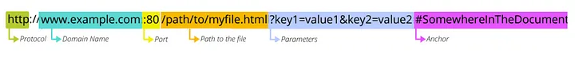
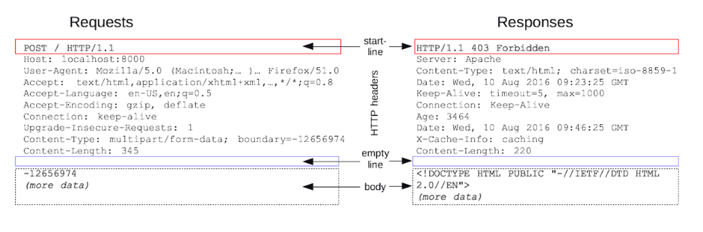

전 세계의 웹브라우저, 서버, 웹 애플리케이션은 모두 HTTP 프로토콜을 통해 서로 대화한다. HTTP 통신은 전송 중 파괴되거나, 중복되거나, 왜곡되는 것을 걱정하지 않아도 된다.

- 웹 클라이언트와 서버
    - 클라이언트는 서버에게 HTTP 요청을 보내고 서버는 요청된 데이터를 HTTP 응답으로 돌려준다. 월드 와이드 웹(WWW)의 기본 요소다.

- 리소스
    - 웹 서버는 웹 리소스를 관리하고 제공한다. 그림파일, 텍스트파일 등 어떤 종류의 콘텐츠 소스도 리소스가 될 수 있다.(웹서버가 제공하는 모든 컨텐츠)

- 미디어 타입(MIME)
    - 인터넷은 수천 가지 데이터 타입을 다루기 때문에 객체 각각에 MIME 타입을 붙인다. 웹 클라이언트는 서버로부터 객체를 돌려받을 때, 다룰 수 있는 객체인지 MIME 타입을 통해 확인한다.
    - MINE 타입은 주 타입/부 타입으로 구분된다.
    
    [일반 MIME 타입 - HTTP | MDN](https://developer.mozilla.org/ko/docs/Web/HTTP/Basics_of_HTTP/MIME_types/Common_types)
    
- URI(식별자)
    - **URI** 통합 자원 식별자로 하나의 리소스를 가리키는 문자열.
    - 인터넷의 우편물 주소 같은 것으로 정보 리소스를 고유하게 식별하고 위치를 지정할 수 있다.
        .webp>)
        
- URL(식별자 + 위치)
    - **URL** 통합 자원 지시자 특정 서버의 한 리소스에 대한 구체적인 위치를 서술한다.
    - 표준 포맷 - 스킴(프로토콜 서술), 인터넷 주소, 리소스.
        
        
- URN
    - URN 유니폼 리소스 이름. 콘텐츠 이루는 한 리소스에 대해, 그 리소스의 위치에 영향 받지 않는 유일무이한 이름 역할을 한다.
    - 리소스를 이리 저리로 옮기더라도 문제없이 동작한다.

- 트랜잭션
    - HTTP 트랜잭션은 요청 명령 ↔ 응답결과로 구성 되어있다.

- 메소드
    - HTT 요청 메시지는 한 개의 메서드를 갖는다.
    - GET : 리소스 조회
    - POST: 요청 데이터 처리, 주로 등록에 사용
    - PUT : 리소스를 대체(덮어쓰기), 해당 리소스가 없으면 생성
    - PATCH : 리소스 부분 변경
    - DELETE : 리소스 삭제
    - HEAD : GET과 동일하지만 메시지 부분(body 부분)을 제외하고, 상태 줄과 헤더만 반환
    - OPTIONS : 대상 리소스에 대한 통신 가능 옵션(메서드)을 설명(주로 CORS에서 사용)
    - CONNECT : 대상 자원으로 식별되는 서버에 대한 터널을 설정
    - TRACE : 대상 리소스에 대한 경로를 따라 메시지 루프백 테스트를 수행
    
- 상태코드
    - 모든 응답 메시지는 상태 코드와 함께 반환된다.
    - 정보 응답 ( 100– 199)
    - 성공적인 응답 ( 200– 299)
    - 리디렉션 메시지 ( 300– 399)
    - 클라이언트 오류 응답 ( 400– 499)
    - 서버 오류 응답 ( 500– 599)
    
    [HTTP response status codes - HTTP | MDN](https://developer.mozilla.org/en-US/docs/Web/HTTP/Status)
    
- 메시지
    - 시작줄, 헤더, 본문
    - 헤더는 빈줄로 끝난다.
        
    
- TCP / IP
    - HTTP는 애플리케이션 계층 프로토콜이다
    - TCP
        - 오류 없는 데이터 전송
        - 순서에 맞는 전달
        - 조각나지 않는 데이터 스트림
    - 일단 TCP 커넥션이 맺어지면 클라이언트아 서버 컴퓨터 간에 교환되는 메시지가 없어지거나, 손상되거나, 순서가 바뀌는 일은 없다.
    - [3-way handshake, 4-Way Handshake] TCP/IP 프로토콜을 이용해서 통신을 하는 응용프로그램이 데이터를 전송하기 전에 먼저 정확한 전송을 보장하기 위해 상대방 컴퓨터와 사전에 세션을 수립하는 과정을 말한다.
    .png>)
    
- 프로토콜 버전
    - HTTP 0.9
        - 오직 GET, MINE 타입, HTTP 헤더, 버전 정보를 지원하지 않음
    - HTTP 1.0
        - 헤더 메소드 추가 및 멀티미디어 객체 처리 추가
    - HTTP 1.0+
        - Keep-alive, 가상호스팅 지원
    - HTTP 1.1
        - 1.0 구조적 결함 교정, 성능 최적화, 잘못된 기능 제거
    - HTTP 2.0
        - 1.1 성능 문제를 개선 구글 PSDY 프로토콜을 기반

- 프록시
    - 주로 보안을 위해 사용한다. 클라이언트와 서버 사이에 위치하며, 요청과 응답을 필터링 한다

- 캐시
    - 자주 찾는 문서의 사본을 저장해둔다. 멀리 떨어집 웹 서버보다 근처의 캐시에서 훨씬 더 빨리 문서를 다운 받을 수 있다.
    
- 게이트워이
    - 주로 HTTP 트래픽을 다른 프로토콜로 변환하기 위해 사용.

- 터널
    - 날 데이터를 그대로 전달해주는 애플리케이션
    - 예로 암호화된 SSL 트래픽을 HTTP 커넥션으로 전송함으로써 웹 트래픽만 허용하는 사내 방화벽을 통과시키는 것

- 에이전트
    - 웹 요청을 만드는 애플리케이션은 뭐든 HTTP 에이젼트
    - 스파이더, 웹로봇