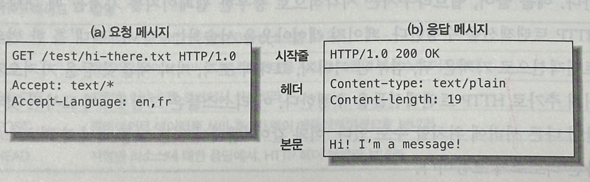

# 01. HTTP 개관

 

## 1.1 HTTP: 인터넷의 멀티미디어 배달부

신뢰성 있는 데이터 전송 프로토콜을 사용
 - `사용자`는 정보가 손상된 것이 아닌지 염려하지 않아도 된다.
 - `개발자`는 결함이나 약점에 대한 걱정 없이 고유 기능 구현에 집중 가능.

 

## 1.2 웹 클라이언트와 서버

- <b>웹 서버</b>
    - 인터넷의 데이터를 저장
    - HTTP 클라이언트가 요청한 데이터를 제공
- <b>웹 클라이언트</b>
    - 가장 흔한 클라이언트는 웹브라우저로, 웹 서버에게 HTTP 객체를 요청하고 사용자의 화면에 보여준다.

    

 

## 1.3 리소스

웹 서버는 `정적 파일`이나 요청에 따라 콘텐츠를 생산하는 `동적 콘텐츠`를 관리하고 제공한다.

### 미디어 타입

`MIME(Multipurpose Internet Mail Extensions)` 타입이라는 데이터 포맷 라벨을 이용

- 웹 서버는 <b>모든 HTTP 객체 데이터에 MIME 타입을 붙인다.</b>
- 웹 클라이언트는 MIME 타입을 통해 다룰 수 있는 객체인지 확인한다.
- MIME 타입은 `주 타입(primary object type)`과 `부 타입(specific subtype)`으로 이루어진 문자열 라벨
    | HTTP 리소스 | MIME 타입 |
    | --- | --- |
    | HTML | text/html |
    | plain ASCII 텍스트 문서 | text/plain |
    | JPEG | image/jpeg |
    | GIF | image/gif |
    | WAV 오디오 파일 | audio/wav |
    | 퀵타임 동영상 | video/quicktime |
    | PPT | application/vnd.ms-powerpoint |
    - [그 외의 일반 MIME 타입](https://developer.mozilla.org/ko/docs/Web/HTTP/Basics_of_HTTP/MIME_types/Common_types)

### URI (uniform resouce identifier)

서버 리소스 이름으로, <b>리소스를 고유하게 식별하고 위치를 지정</b>할 수 있다.

#### URL (uniform resource locator)

- 한 리소스에 대한 구체적인 위치를 서술
    - `어디에` 있고, `어떻게` 접근할 수 있는지.
- 대부분 세 부분으로 이루어진 표준 포맷을 따른다.
    
    `http://www.joes-hardware.com/special/saw-balde.gif`
    
    1. scheme. 리소스에 접근하기 위해 사용되는 프로토콜 서술 (http://)
    2. 서버의 인터넷 주소 (www.joes-hardware.com)
    3. 웹 서버의 리소스 (/specials/saw-blade.gif)

#### URN (uniform resource name)

- 리소스의 위치에 영향을 받지 않는 **유일무이한 이름 역할**
- `위치 독립적`이기에 이름을 변경하지 않는 한, 문제없이 동작.

 

## 1.4 트랜잭션

HTTP 트랜잭션은 **요청 명령**과 **응답 결과**로 구성

### 메서드

- 여러가지 종류의 요청 명령을 지원 (서버에게 어떤 동작이 취해져야 하는지)
- 모든 HTTP 요청 메시지는 한 개의 메서드를 갖는다

| HTTP 메서드 | 설명 |
| --- | --- |
| GET | 리소스 취득 (조회) |
| PUT | 리소스 전송 (데이터 대체. 없으면 생성) |
| DELETE | 리소스 삭제 |
| POST | 엔티티 (등록) |
| HEAD | 메시지 헤더 취득 |
| PATCH | 리소스 부분 변경 (HTTP 1.0에서는 제공 X) |
- [HTTP 요청 메서드](https://developer.mozilla.org/ko/docs/Web/HTTP/Methods)

### 상태 코드

- 모든 HTTP 응답 메시지는 상태 코드와 함께 반환

    | HTTP 상태 코드 | 설명 |
    | --- | --- |
    | 200 | 좋다. 문서가 바르게 반환되었다. |
    | 302 | 다시 보내라(Redirection). 다른 곳에 가서 리소스를 가져가라. → 일시적으로 새로운 URL로 이동 |
    | 404 | 없음. 리소스를 찾을 수 없다. |
    | 500 | 내부 서버 오류. 서버에 에러가 발생하였다. |

- 1xx (정보)
    - 임시 응답으로 현재 클라이언트의 요청까지는 처리되었으니 계속 진행하라는 의미. HTTP 1.1 버전부터 추가.
- 2xx (성공)
    - 클라이언트의 요청이 서버에서 성공적으로 처리되었다는 의미.
- 3xx (리다이렉션)
    - 완전한 처리를 위해서 추가 동작이 필요한 경우. 주로 서버의 주소 또는 요청한 URI의 웹 문서가 이동되었으니 그 주소로 다시 시도하라는 의미.
    - [상태코드 301과 302의 차이점](https://inpa.tistory.com/entry/HTTP-%F0%9F%8C%90-301-vs-302-%EC%83%81%ED%83%9C-%EC%BD%94%EB%93%9C-%EC%B0%A8%EC%9D%B4%EC%A0%90-%F0%9F%92%AF-%EC%99%84%EB%B2%BD-%EC%A0%95%EB%A6%AC)
    - [상태코드 307과 308](https://inpa.tistory.com/entry/HTTP-%F0%9F%8C%90-3XX-Redirection-%EC%83%81%ED%83%9C-%EC%BD%94%EB%93%9C-%EC%A0%9C%EB%8C%80%EB%A1%9C-%EC%95%8C%EC%95%84%EB%B3%B4%EA%B8%B0#307_temporary_redirect)
- 4xx (클라이언트 오류)
    - 없는 페이지를 요청하는 등 클라이언트의 요청 메시지 내용이 잘못된 경우를 의미.
- 5xx (서버 오류)
    - 서버 사정으로 메시지 처리에 문제가 발생한 경우입니다. 서버의 부하, DB 처리 과정 오류, 서버에서 익셉션이 발생하는 경우를 의미.

### 웹페이지는 여러 객체로 이루어질 수 있다

- 애플리케이션은 하나의 작업을 수행하기 위해 보통 여러 HTTP 트랜잭션을 수행
- 웹페이지는 보통 하나의 리소스가 아닌 <b>리소스의 모음</b>

 

## 1.5 메시지

HTTP 요청 메시지 및 응답 메시지의 구조

- <b>시작줄</b>
    - 요청 메시지 : 무엇을 해야 하는지
    - 응답 메시지 : 무슨 일이 일어났는지
- <b>헤더</b>
    - 하나의 이름과 하나의 값으로 구성하며 쌍점(:)으로 구분
    - 0개 이상으로 구성
    - 헤더는 빈 줄로 끝난다.
- <b>본문</b>
    - 어떤 종류의 데이터든 들어갈 수 있다
    - 요청 본문 : 웹 서버로 데이터를 실어 보냄
    - 응답 본문 : 클라이언트로 데이터를 반환

    

 

## 1.6 TCP (Transmission Control Protocol) 커넥션

### TCP/IP

HTTP는 애플리케이션 계층 프로토콜로,네트워크 통신의 핵심적인 세부사항에 대해서는 TCP/IP에게 맡김.

- TCP 커넥션 시 제공
    - 오류 없는 데이터 전송
    - 순서에 맞게 전달
    - 조각나지 않는 데이터 스트림
- 패킷 교환 네트워크 프로토콜의 집합
    - TCP는 전송 계층 / IP는 네트워크 계층 
    - TCP/IP 프로토콜 계층

        

    - OSI 7 Layer
    
        
    
 

## 1.7 프로토콜 버전
- <b>HTTP/0.9</b>
    - GET 메서드만 지원
    - MIME 타입이나 HTTP 헤더, 버전 번호 미지원. <b>간단한 HTML 객체를 받아오기 위해 만들어짐</b>.
- <b>HTTP/1.0</b>
    - 널리 쓰이기 시작한 버전
    - <b>버전번호, HTTP 헤더, 추가 메서드 (POST, HEAD), 멀티미디어 객체 처리 , 응답 상태 코드 추가</b>
- <b>HTTP/1.0+</b>
    - `keep-alive` 커넥션, 가상 호스팅 지원, 프락시 연결 지원 등 추가
    - keep-alive
        - persistent connection을 맺는 기법 (1.1 부터는 기본 지원)
        - 반복되는 핸드쉐이크 과정을 줄여 응답속도 개선
            
        
            
- <b>HTTP/1.1</b>
    - HTTP 설계의 구조적 결함 교정, 성능 최적화, 잘못된 기능 제거
    - 더 복잡해진 웹 애플리케이션 배포 지원
- <b>HTTP/2.0</b>
    - 성능 문제 개선을 위해 구글의 SPDY 프로토콜 기반으로 설계
            
        
            
    - [HTTP 2.0](https://inpa.tistory.com/entry/WEB-%F0%9F%8C%90-HTTP-20-%ED%86%B5%EC%8B%A0-%EA%B8%B0%EC%88%A0-%EC%9D%B4%EC%A0%9C%EB%8A%94-%ED%99%95%EC%8B%A4%ED%9E%88-%EC%9D%B4%ED%95%B4%ED%95%98%EC%9E%90#spdy_%ED%94%84%EB%A1%9C%ED%86%A0%EC%BD%9C)
    - [SPDY](https://d2.naver.com/helloworld/140351)
   
 
 
## 1.8 웹의 구성요소
- <b>프락시</b>
    - 클라이언트와 서버 사이에 위치한 **HTTP 메시지를 정리하는 중개자**
    - 주로 보안을 위해 사용. 요청과 응답을 필터링한다.
- <b>캐시</b>
    - 문서들 중 자주 사용되는(찾는)것의 사본을 저장해두는 특별한 종류의 HTTP 프락시 서버
    - 멀리 떨어진 웹 서버보다 근처의 캐시에서 훨씬 더 빨리 문서 다운 가능.
- <b>게이트웨이</b>
    - 다른 애플리케이션과 연결된 특별한 웹 서버
    - 다른 서버들의 중개자로 동작하는 특별한 서버로,  HTTP 트래픽을 다른 프로토콜로 변환하기 위해 사용한다.
    - HTTP/FTP 게이트웨이
            
        
            
    - 프락시와 게이트웨이의 차이점
            
            
        | 프락시 | 게이트웨이 |
        | --- | --- |
        | 동일 프로토콜로 연결 | 서로 다른 프로토콜 간을 변환시켜주며 연결 |
        | 통신 내용을 이해할 필요가 있다. (필터링 등) | 통신 내용을 그대로 전달 |
        | 필요에 따라 내용 수정 가능 | 내용 수정 불가능 |
        | 서버 대신 응답 가능 | 클라이언트가 중간에 게이트웨이 존재 여부를 전혀 인식 못하게 함 |
- <b>터널</b>
    - 두 커넥션 사이에서 raw 데이터를 그대로 전달해주는 특별한 프락시
    - HTTP 터널은 주로 비 HTTP 데이터를 하나 이상의 HTTP 연결을 통해 그대로 전송해 주기 위해 사용한다.
    - 암호화된 SSL 트래픽을 HTTP 커넥션으로 전송
            
        (터널은 443 포트에 전송해야할 SSL 트래픽을 기존 HTTP 커넥션을 통해서 전송)
            
        
            
- <b>에이전트</b>
    - HTTP 요청을 만들어주는 클라이언트 프로그램
    - 웹 요청을 만드는 애플리케이션은 모두 HTTP 에이전트
            
        e.g.) 웹 브라우저, 스파이더, 웹로봇
