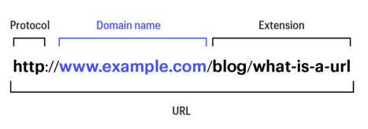

# URL과 리소스

URL : 브라우저가 정보를 찾는데 필요한 리소스의 위치
     
=> 모든 사람이 같은 방식을 사용해서 인터넷 상의 모든 리소스를 가져오기 위한 작명 규칙



## 1. 구성
- 스킴
  - URL의 첫 부분
  - 클라이언트가 어떻게 리소스에 접근하는지 알려줌
    - http
    - mailto
    - ftp
    - rtsp
- 서버의 위치
  - 웹 클라이언트의 리소스가 어디에 호스팅 되어 있는지 알려줌
- 리소스의 경로
  - 서버에 존재하는 로컬 리소스들 중 요청 받은 리소스가 무엇인지 알려줌
## 2. 문법 
서로 다른 스킴이어도 일반적으로 비슷한 형태의 문법을 사용
```
<스킴>://<사용자 이름>:<비밀번호>@<호스트>:<포트>/<경로>;<파라미터>?<질의>#<프래그먼트>
```
- 스킴
  - 주어진 리로스에 어떻게 접근하는지 알려주는 정보
  - 알파벳으로 시작
  - : 문자로 스킴과 나머지를 구분
  - 대소문자를 구분하지 않음


- 사용자 이름과 비밀번호
  - 데이터 접근 허용 전 서버가 요구하는 이름과 비밀번호


- 호스트와 포트
  - 호스트
    - 접근하려는 리소를 갖고있는 인터넷상의 호스트 장비
  - 포트
    - 서버가 열어놓은 네트워크 포트
    - 내부적으로 TCP 프로토콜을 사용하는 HTTP는 기본이 80
    - 프로토콜별 기본 포트 : https://en.wikipedia.org/wiki/List_of_TCP_and_UDP_port_numbers#Well-known_ports

- 경로
  - 리소스가 서버의 어디에 있는지 알려줌
  - 계층적 파일 시스템 경로와 유사한 구조


- 파라미터
  - 서버에 정확한 요청을 하기 위해 필요한 추가 정보
  - `http://www.joes-hardware.com/hammer;sale=false/index.html;graphics=true`


- 질의 문자열
  - 요청받을 리소스 형식의 범위를 좁히기 위해서 사용
  - `http://www.joes-hardware.com/inventory-check.cgi?item=12731&size=big&color=blue&location=`


- 프래그먼트
  - 서버에서 응답받은 데이터 중 클라이언트가 사용하기 위한 특정 데이터
  - 서버로 요청을 전송하지 않음

## 3.상대 URL
단축된 URL로 모든 URL 을 작성하지 않아도 리소스에 접근 가능
- 기저 URL
  - 상대 URL의 기준
  - 리소스에서 명시적으로 제공
  - 해당 리소스의 URL 을 기저 URL 로 사용 
    - ch02 폴더에 image 파일이 존재한다고 했을 때 
      image 파일의 URL 을 적지않아도 hailey.md 의 URL 이 cho2에 위치하기 때문에 
      image 파일의 URL 도  ch02/image 로 사용
  - 기저 URL 이 없는 경우
    - 절대 URL 로만 이루어진 경우
    - 불완전 URL
    - 깨진 URL

- URL 확장
  - 사용자의 시간을 줄여줌
  - 호스트명 확장
    - naver 만 입력해도 www. 과 com.을 붙여줌
  - 히스토리 확장
    - 과거 사용자의 히스토리 자동완성


## 4.안전하지 않은 문자
이스케이프 기능을 통해 안전하지 않은 문자를 안전한 문자로 인코딩
- 안전하지 않은 문자를 % 로 시자가해 ASCII 코드로 표현되는 16진수 숫자로 이루어진 이스케이프 문자로 치환
- 문자 제한 
  - 게이트웨이, 프로토콜에서 혼동되는 것을 방지하고자 사용을 제한 하는 문자
    - % / . .. # ? 등

## 5.스킴의 종류
- http : 하이퍼텍스트 전송 프로토콜
- https : http와 거의 동일 암호화가 추가 됨
- mailto : 이메일 전송
- ftp : 파일 전송 


