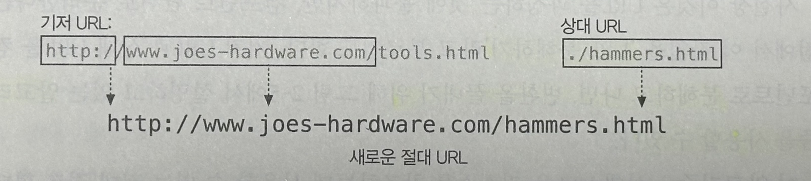
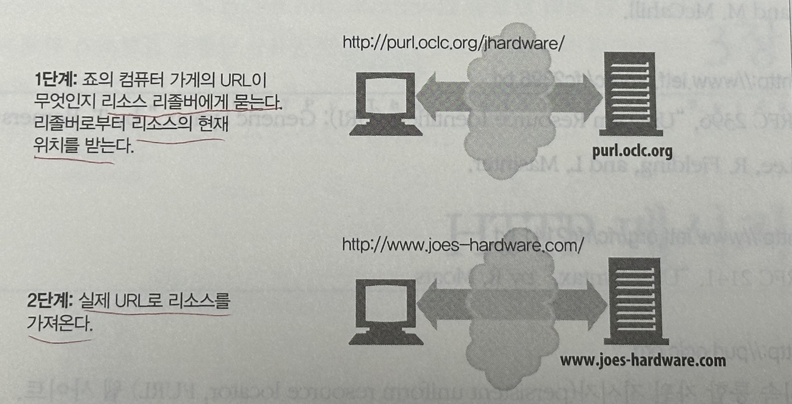

# 02. URL과 리소스

## 2.1 인터넷의 리소스 탐색하기
URL은 정보를 찾는데 필요한 **리소스의 위치**를 가리킨다.

- 대부분은 `스킴://서버위치/경로` 구조로 이루어짐.

 

## 2.2 URL 문법

URL 문법은 스킴에 따라 달라지며 대부분의 URL 스킴의 문법은 일반적으로 **9개 부분**으로 나뉜다.

`<스킴>://<사용자 이름>:<비밀번호>@<호스트>:<포트>/<경로>;<파라미터>?<질의>#<프래그먼트>`

| 컴포넌트 | 설명 | 기본값 |
| --- | --- | --- |
| 스킴 | 리소스를 가져오려면 어떤 프로토콜을 사용하여 서버에 접근해야 하는지를 가리킨다. | X |
| 사용자 이름 | 리소스에 접근하기 위한 사용자 이름 | anonymous |
| 비밀번호 | 사용자의 비밀번호 | <이메일 주소> |
| 호스트 | 리소스를 호스팅하는 서버의 호스트 명이나 IP 주소 | X |
| 포트 | 호스팅하는 서버가 열어놓은 포트번호 (http의 기본 포트는 80, https는 443) | 스킴에 따라 상이 |
| 경로 | 서버 내 리소스가 어디에 있는 지를 가리킴. 서버와 스킴에 따라 문법이 다르다. | X |
| 파라미터 | 입력 파라미터를 기술하는 용도로 사용. 이름/값을 쌍으로 갖으며 세미콜론으로 구분하여 여러 개를 가질 수 있다. | X |
| 질의 | 스킴에서 애플리케이션에 파라미터를 전달하는데 사용. URL의 끝에 ? 로 구분 | X |
| 프래그먼트 | 리소스의 조각이나 일부분을 가리키는 이름. 클라이언트에서만 사용되며 URL의 끝에서 # 문자로 구분 | X |

 

### 스킴:사용할 프로토콜

주어진 리소스에 `어떻게` 접근하는지 알려주는 중요한 정보

- 알파벳으로 시작하며 `:` 으로 구분.
- 스킴명은 대소문자를 가리지 않는다.

 

### 호스트와 포트

- 호스트 컴포넌트 : 접근하려고 하는 리소스를 가지고 있는 인터넷상의 호스트 장비를 가리키며, 호스트 명이나 IP주소로 제공
- 포트 컴포넌트 : 서버가 열어놓은 네트워크 포트

 

### 사용자 이름과 비밀번호

서버의 데이터에 접근을 허용하기 전에 사용자 이름과 비밀번호를 요구

e.g.) FTP 서버

 

### 경로

리소스가 서버의 `어디에` 있는지 알려준다.

- `/` 문자를 기준으로 경로조각으로 나뉘며, 각 경로조각은 자체만의 파라미터 컴포넌트를 가질 수 있다.

 

### 파라미터

애플리케이션이 서버에 정확한 요청을 하기 위해 필요한 입력 파라미터를 받는데 사용.

- 이름/값 쌍의 리스트로 `;` 문자로 구분하여 URL에 기술
    - `http://www.joes-hardware.com/hammers;sale=false/index.html;graphics=true`
- 네이버 카페 게시글 쓰기 Scheme
    - `navercafe://write?cafeUrl={카페URL}&menuId={메뉴번호}&subject={제목}&contents={글내용}&attachment={파일path1};{파일path2};{파일path3}&appId={호출자ID}`

 

### 질의 문자열

요청받을 리소스 형식의 범위를 좁히기 위해서 질문이나 질의를 받을 수 있다.

- 게이트웨이를 가리키는 URL의 경로 컴포넌트와 함께 전달
- 특정 문자들을 제외하고는 포맷에 제약사항은 없다.
- 편의상 많은 게이트웨이가 `&` 로 나뉜 `이름=값` 형식의 질의 문자열을 원한다.

 

### 프래그먼트

HTML 같은 리소스 형식들은 본래의 수준보다 더 작게 나뉠 수 있는데, 이러한 리소스의 특정 부분을 가리킬 수 있도록 프래그먼트 컴포넌트를 제공.

- `#` 문자에 이어서 온다.
- **서버에 프래그먼트를 전달하지 않고**, 서버로부터 전체 리소스를 내려받은 후 **클라이언트가 프래그먼트를 사용하여 리소스의 일부를 보여준다**. (서버는 객체를 전체 단위로만 전송하기 때문)
- 네이버의 footer로 이동하기
    - [https://www.naver.com#footer](https://www.naver.com/#footer)

 

## 2.3 단축 URL

URL은 `상대 URL`과 `전체 URL`로 나뉜다.

절대 URL은 리소스에 접근하는데 필요한 모든 정보를 가지고 있다.

### 상대 URL

리소스 안에 있는 리소스를 간결하게 기술하는데 사용

- 기저(base) URL을 사용하여 짧게 표기하는 방식. (상대경로로 해석)
- base URL은 `<BASE>` HTML 태그를 통해 명시적으로 제공할 수 있으며, 해당 리소스의 URL을 base URL로 쓸 수 있다. 

  (없는 경우도 있는데, 이런 경우는 보통 절대 URL 만으로 이루어지거나 불안전하거나 깨진 URL)

- base URL : `http://www.joes-hardware.com/tools.html`
- 상대 URL : `./hammers.html`
- 새로운 절대 URL : `http://www.joes-hardware.com/hammers.html`

### URL 확장

사용자가 URL을 빠르게 입력하게 도와준다.

- 호스트명 확장 : 입력한 호스트 명을 전체 호스트 명으로 확장
    - `naver` 입력 → `[www.naver.com](http://www.naver.com)` 으로 만든다.
    - 만약 찾지 못한다면, 몇 가지 URL을 추가로 제시
- 히스토리 확장
    - 과거에 사용자가 방문했던 URL의 기록을 저장하여, 일부 입력 시 완결된 형태의 URL들을 선택하게 해준다.

 

## 2.4 안전하지 않은 문자

안전한 전송이란, **정보가 유실될 위험 없이 URL을 전송할 수 있다는 것**을 의미.

이를 방지하기 위해, URL은 일반적으로 안전한 **알파벳 문자**와 그 외의 안전하지 않은 문자를 안전한 문자로 인코딩하기 위한 `이스케이프`라는 기능을 추가하여 설계

 

### URL 문자 집합

특정 이진 데이터나 알파벳 외의 문자를 포함하기 위해 이스케이프 문자열을 쓸 수 있게 설계
- 이스케이프 문자열 : US-ASCII에서 사용이 금지된 문자들로, 특정 문자나 데이터를 인코딩할 수 있게 함.

 

### 인코딩 체계

안전하지 않은 문자를 `%` 기호로 시작해, ASCII 코드로 표현되는 두 개의 16진수 숫자로 이루어진 `이스케이프` 문자로 변환.

| 문자 | ASCII 코드 | URL의 예 |
| --- | --- | --- |
| ~ | 126 (0x7E) | http://www.joes-hardware.com/%7Ejoe |
| 빈 문자 | 32 (0x20) | http://www.joes-hardware.com/more%20tools.html |
| % | 37 (0x25) | http://www.joes-hardware.com/100%25satisfaction.html |

 

### 문자 제한

몇몇 문자는 URL 내에서 특별한 의미로 **예약**되어 있다.

본래의 목적이 아닌 다른 용도로 사용하려면 `반드시` 인코딩 필요.

- `%`, `/`, `.`, `..`, `#`, `?`, `;`, `:`, `$`, `+`, `@`, `&`, `=`, `{`, `}`, `|` , `\` 등

 

### 좀 더 알아보기

- <b>클라이언트 애플리케이션에서 안전하지 않거나 제한된 문자를 변환하는 것이 좋다.</b>
    
    → 혼동할 걱정 없이, 애플리케이션 간에 공유할 수 있는 URL의 원형을 유지할 수 있음.
    
- 모든 문자를 인코딩하는 것은 <b>비추천</b>.
    
    → 오동작 우려 (안전한 문자들을 인코딩하지 않는 애플리케이션도 있기 때문에)
    
 

## 2.5 스킴의 바다

| 스킴 | 설명 |
| --- | --- |
| http | 일반 URL 포맷을 지키는 하이퍼텍스트 전송 프로토콜(Hypertext Transfer Protocol) 스킴 |
| https | http 스킴과 거의 동일. HTTP의 커넥션 양 끝단에서 암호화하기 위해 개발된 보안 소켓 계층(Secure Sockets Layer, SSL)을 사용 |
| mailto | 이메일 주소를 가리키며, 표준 URL과는 다른 포맷을 가진다. |
| ftp | 파일 전송 프로토콜(File Transfer Protocol) URL은 파일 다운로드 및 업로드, 콘텐츠 목록 조회에 사용 |
| rtsp, rtspu | RTSP URL은 실시간 스트리밍 프로토콜 (Real Time Streaming Protocol)을 통해서 읽을 수 있는 오디오 및 비디오와 같은 미디어 리소스 식별자. (rtspu의 u는 리소스를 읽기 위해 UDP 프로토콜이 사용됨을 뜻함) |
| file | 주어진 호스트 기기에서 바로 접근할 수 있는 파일들을 나타냄 |
| news | 특정 문서나 뉴스 그룹에 접근하는데 사용 |
| telnet | 대화형 서비스(Interactive Service)에 접근하는데 사용.  |

<aside>

> 💡 **대화형 서비스**란?
 
사용자가 직접 서비스나 응용 프로그램과 상호 작용할 수 있는 컴퓨터 기반 서비스를 말한다. 이러한 서비스는 일반적으로 사용자가 직접 입력하고 피드백을 받아들이는 것을 포함하며, 사용자와 시스템 간의 실시간 상호 작용이나 통신을 통해 작업을 수행하고 정보를 교환하거나 응답을 받을 수 있다.

</aside>

 

## 미래

URL은 특정 시점에 **어떤 것이 위치한 곳**을 알려준다.

이로인해, 리소스가 옮겨지면 URL을 더는 사용할 수 없어서, 해당 시점에서는 기존 URL이 가리키고 있던 객체를 찾을 수 없다.

#### URN
- 객체 <b>고유의 이름</b>을 사용
- 객체가 옮겨지더라도 항상 객체를 가리킬 수 있는 이름을 제공
- `지속 통합 자원 지시자(Persistent uniform resource locators, PURL)`을 사용하면 URL로 URN의 기능을 제공할 수 있다.
- PURL은 리소스의 실제 URL 목록을 관리 및 추적하는 중개 서버를 두고, 해당 리소스를 우회적으로 제공.
            
    
            
- 주소체계를 `URL → URN` 으로 바꾸는 것은 큰 작업으로, URL은 당분간 계속 사용될 것이다.