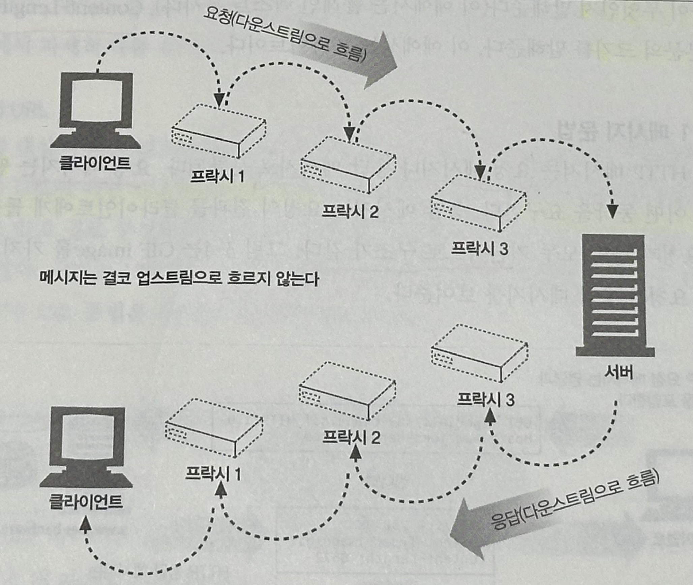
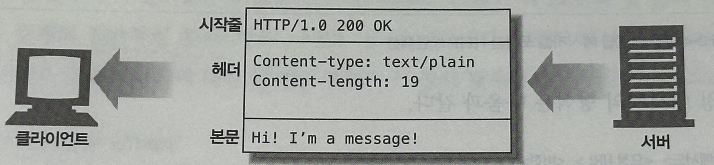

# 03. HTTP 메시지

## 3.1 메시지의 흐름

**HTTP 메시지** : HTTP 애플리케이션 간에 주고받은 데이터의 블록들

- 메시지의 `내용`과 `의미`를 설명하는 **텍스트 메타 정보**로 시작
- 그 다음에 선택적으로 데이터가 올 수 있다.
- 클라이언트, 서버, 프락시 사이를 흐른다.

### 3.1.1 메시지는 원 서버 방향을 인바운드로 하여 송신된다

- 인바운드 : 메시지가 원 서버로 향하는 것
- 아웃 바운드 : (모든 처리가 끝난 뒤) 메시지가 사용자 에이전트로 돌아오는 것

`인바운드`, `아웃바운드`는 **트랜잭션 방향**을 표현하기 위해 사용.

→ 서버 입장에서 생각.

### 3.1.2 다운스트림으로 흐르는 메시지

- 모든 메시지(요청 / 응답 관계없이)는 **다운스트림**으로 흐른다.
- 발송자는 수신자의 **업스트림**



---

## 3.2 메시지의 각 부분

메시지는 `시작줄`, `헤더 블록`, `본문` 세 부분으로 이루어진다.



시작줄과 헤더는 줄 단위로 분리된 아스키 문자열. 각 줄은 CRLF 줄바꿈 문자열로 끝난다.

> **CRLF (Carriage Return Line Feed)**

**CR(\r)** : 현재 커서를 줄 올림 없이 가장 앞으로 옮기는 동작
**LF(\n) :** 커서는 그 자리에 그대로 둔 상황에서 종이만 한 줄 올려 줄을 바꾸는 동작
> 
> 
> 
> **OS별 개행 문자 표현**
> 
> **Window** : `\r\n`
> **Unix / Linux / Mac** : `\n`
> 


이러한 표현때문인지,

오래되거나 잘못 만들어진 일부 HTTP 애플리케이션들에서 LF만 사용하는 경우가 있어서, **CRLF가 아닌 LF도 받아들일 수 있어야 한다.**

### 3.2.1 메시지 문법

모든 HTTP 메시지는 `요청 메시지`나 `응답 메시지` 로 분류되며, **기본적으로 구조가 같다.**

**요청 메시지**

→ 웹 서버에 어떤 동작을 요구

```
<메서드> <요청 URL> <버전>
<헤더>

<엔터티 본문>

->
GET /test/test.png HTTP/1.1
Host: www.naver.com
```

**응답 메시지**

→ 요청의 결과를 클라이언트에게 돌려준다.

```
<버전> <상태 코드> <사유 구절>
<헤더>

<엔터테 본문>

->
HTTP/1.1 200 성공
Content-Type: image/png
Content-Length: 8572
```

- **메서드**
    
    `클라이언트 측`에서 **서버가 리소스에 대해 수행해주길 바라는 동작**
    

- **요청 URL**
    
    요청 대상이 되는 리소스를 지칭하는 완전한 URL 혹은 URL의 경로 구성요소
    

- **버전**
    
    HTTP의 버전 (`HTTP/<메이저>.<마이너>`). 메이저와 마이너 모두 정수다.
    

- **상태코드**
    
    요청 중에 무엇이 일어났는지 설명하는 세 자리의 숫자.
    

- **사유구절(reason-phrase)**
    
    상태 코드의 의미를 사람이 이해할 수 있게 설명해주는 짧은 문구
    

- **헤더들**
    - 이름, 콜론(`:`), 선택적인 공백, 값, CRLF가 순서대로 나타나는 0개 이상의 헤더들.
    - 헤더의 목록은 CRLF로 끝나 헤더 목록의 끝과 엔터티 본문의 시작을 표시

- **엔터티 본문**
    - 임의의 데이터 블록을 포함한다.
    - 모든 메시지가 엔터티 본문을 갖는 것은 아니여서, 그냥 CRLF로 끝나는 경우가 있다.
        
        (헤더나 엔터티 본문이 없더라도 항상 CRLF로 끝나야 한다.)
        

### 3.2.2 시작줄

모든 HTTP 메시지는 `시작줄`로 시작.

**요청 메시지의 시작줄** → `무엇`을 해야 하는지 말해준다.

**응답 메시지의 시작줄** → `무슨 일`이 일어났는지 말해준다.

- **요청줄**
    
    서버에게 리소스에 대해 `무언가`를 해달라고 부탁. 모든 필드는 `공백`으로 구분된다.
    
    - 서버에서 어떤 동작이 일어나야 하는지 설명해주는 `**메서드**`
    - 대상을 지칭하는 **`요청 URL`**
    - `**HTTP 버전**`

- **응답줄**
    
    수행 결과에 대한 `상태 정보`와 `결과 데이터`를 반환. 모든 필드는 `공백`으로 구분된다.
    
    - `**HTTP 버전**`
    - `**상태 코드**`
    - `**사유 구절**` (수행 상태에 대해 설명해주는 텍스트)

- **메서드**
    
    서버에게 `무엇을` 해야 하는지 말해준다.
    
    | 메서드 | 설명 | 메시지 본문 |
    | --- | --- | --- |
    | GET | 서버에서 어떤 문서를 가져온다. | 없음 |
    | HEAD | 서버에서 어떤 문서에 대한 헤더만 가져온다. | 없음 |
    | POST | 서버가 처리해야 할 데이터를 보낸다. | 있음 |
    | PUT | 서버에 요청 메시지의 본문을 저장한다. | 있음 |
    | TRACE | 메시지가 프락시를 거쳐 서버에게 도달하는 과정을 추적한다. | 없음 |
    | OPTIONS | 서버가 어떤 메서드를 수행할 수 있는지 확인한다. | 없음 |
    | DELETE | 서버에서 문서를 제거한다. | 없음 |

- **상태 코드**
    
    클라이언트에게 무엇이 일어났는지 말해준다.
    
    | 전체 범위 | 정의된 범위 | 분류 |
    | --- | --- | --- |
    | 100-199 | 100-101 | 정보 |
    | 200-299 | 200-206 | 성공 |
    | 300-399 | 300-305 | 리다이렉션 |
    | 400-499 | 400-415 | 클라이언트 에러 |
    | 500-599 | 500-505 | 서버 에러 |

- **사유 구절**
    
    응답 시작줄의 마지막 구성요소. 상태 코드에 대한 글로 된 설명을 제공
    

- **버전 번호**
    
    HTTP/x.y 형식으로, 요청과 응답 메시지 양쪽 모두에 기술된다.
    

### 3.2.3 헤더

HTTP 헤더 필드는 요청과 응답 메시지에 추가 정보를 더한다.

기본적으로 `이름/값` 쌍의 목록이다.

- **헤더 분류**
    
    HTTP 헤더 명세는 여러 헤더 필드를 정의하며, 자유롭게 **자신만의 헤더**를 만들어낼 수 있다.
    
    - 일반 헤더 :  **요청과 응답 양쪽에 모두 나타날 수 있다.**
    - 요청 헤더 : **요청**에 대한 부가 정보를 제공
    - 응답 헤더 : **응답**에 대한 부가 정보를 제공
    - Entity 헤더 : **본문 크기와 콘텐츠** 혹은 **리소스 그 자체**를 서술
    - 확장 헤더 : 명세에 정의되지 않은 **새로운 헤더**

- **헤더를 여러 줄로 나누기**
    
    가독성을 위해 여러 줄로 쪼개는 것이 가능. 추가 줄 앞에는 최소 **하나**의 `스페이스 혹은 탭 문자`가 와야한다.
    
    ```
    HTTP/1.1 200 성공
    Content-Type: image/png
    Content-Lenghth: 8572
    Server : Test Server
    	Version 1.0
    ```
    

### 3.2.4 엔터티 본문

이미지, 비디오, HTML 문서, 소프트웨어 애플리케이션, 신용카드 트랜잭션, 전자우편 등 여러 종류의 디지털 데이터를 포함할 수 있다.

### 3.2.5 버전 0.9 메시지

요청은 그저 `메서드`와 `요청 URL`을 갖고 있을 뿐이며, 응답은 오직 `엔터티`로만 구성.

---

## 3.3 메서드

모든 서버가 모든 메서드를 구현하지는 않으며, 대부분 제한적으로 사용된다.

### 3.3.1 안전한 메서드(Safe Method)

요청의 결과로 서버에 어떤 작용도 없는 메서드로 `GET`, `HEAD` 메서드 등이 이에 해당

### 3.3.2 GET

리소스를 달라고 요청하기 위해 사용.

### 3.3.3 HEAD

- 응답으로 헤더만을 돌려준다.
- 개발 시에, 반드시 반환되는 헤더가 GET과 정확히 일치함을 보장해야 한다.
- HTTP/1.1 준수를 위해 HEAD 메서드가 반드시 구현되어 있어야 한다.
- **사용 목적**
    - 리소스를 가져오지 않고도 관련된 정보(타입 등)를 알아낼 수 있다.
    - 상태 코드를 통해 개체의 존재 여부 확인 가능
    - 리소스의 변경 여부 검사

### 3.3.4 PUT

서버가 요청의 본문을 가지고 요청 URL의 이름대로 **새 문서를 `만들거나`**, 이미 존재한다면 **본문을 사용해서 `교체`**하는 것.

### 3.3.5 POST

서버에 입력 데이터를 전송하기 위해 설계

### 3.3.6 TRACE

클라이언트에게 자신의 요청이 서버에 도달했을 때 어떻게 보이게 되는지 알려준다.

- 목적지 서버에서 `루프백(loopback)` 진단을 시작
    - 마지막 단계에 있는 서버는 자신이 받은 `요청 메시지`를 **본문에 넣어 응답을 되돌려준다**.
    - 클라이언트와 목적지 서버 사이의 모든 HTTP 애플리케이션의 요청/응답 연쇄를 따라가면서 **메시지가 망가졌거나 수정되었는지**, 그렇다면 **어떻게 변경되었는지 확인 가능.**
- 주로 `진단`을 위해 사용된다.
    - 의도한 요청/응답 연쇄를 거쳐가는지 검사
    - 프락시나 다른 애플리케이션들이 요청에 어떤 영향을 미치는지 확인에 사용
- 메서드를 구별하는 메커니즘을 제공하지 않는다.
- 요청은 **어떠한 엔터티 본문도 보낼 수 없다.**
    - 응답의 엔터티 본문에 서버가 받은 요청이 그대로 담겨지기 때문.

### 3.3.7 OPTIONS

특정 리소스에 대해 **어떤 메서드가 지원되는지** 물어볼 수 있다.

- `Allow 헤더`와 함께 **지원하는 HTTP 메서드 목록을 반환**

### 3.3.8 DELETE

요청 URL로 지정한 리소스를 삭제할 것을 요청한다. 하지만, **삭제가 수행되는 것을 보장하지는 못한다.**

### 3.3.9 확장 메서드

HTTP/1.1 명세에 정의되지 않은 메서드. 

- 모든 확장 메서드가 형식을 갖춘 명세로 정의된 것은 아니다.
- 확장 메서드에 대해서는 관용적인 것(엄격하게 보내고 관대하게 받아들이는)이 최고다.
- 웹 콘텐츠를 웹 서버로 발행하는 것을 돕는 `WebDEV` HTTP 확장의 일부
    
    
    | 메서드 | 설명 |
    | --- | --- |
    | LOCK | 사용자가 리소스를 잠글 수 있게 해준다. |
    | MKCOL | 사용자가 문서를 생성할 수 있게 해준다. |
    | COPY | 서버에 있는 리소스를 복사한다. |
    | MOVE | 서버에 있는 리소스를 옮긴다. |

---

## 3.4상태 코드

클라이언트에게 트랜잭션을 이해할 수 있는 쉬운 방법을 제공.

### 3.4.1 100-199: 정보성 상태 코드

HTTP/1.1에서 도입

| 상태 코드 | 사유 구절 | 의미 |
| --- | --- | --- |
| 100 | Continue | 요청의 시작 부분 일부가 받아들여졌으며, 나머지를 계속 이어서 보내야 함을 의미 |
| 101 | Switching Protocols | 클라이언트가 Upgrade 헤더에 나열한 것 중 하나로 서버가 프로토콜을 바꾸었음을 의미 |

- 클라이언트와 100 Continue
    
    100 Continue는 최적화를 위한 것으로, 애플리케이션은 서버가 다루거나 사용할 수 없는 큰 엔터티를 서버에 보내지 않으려는 목적으로만 사용해야한다.
    

- 서버와 100 Continue
    
    서버가 100 Continue 값이 담긴 Expect 헤더를 받는다면, `100 Continue` or `에러 코드`로 답해야 한다.
    
    - 100 Continue 응답을 받을 것을 의도하지 않은 클라이언트에게 해당 상태 코드를 보내서는 안 된다.
    - 요청을 끝까지 다 읽은 후에 최종 응답을 보내야 한다.

- 프락시와 100 Continue
    - 다음 홉 서버가 HTTP/1.1을 따르거나 모를 경우 → **Expect 헤더를 포함**하여 요청을 다음으로 전달
    - HTTP/1.0 이나 이전 버전을 따를 경우 → `417 Expectation Failed` 에러로 응답
        - 클라이언트는 어떻게 해야할 지 모르기 때문. (HTTP/1.1 부터 추가되었기에.)

### 3.4.2 200-299: 성공 상태 코드

| 상태 코드 | 사유 구절 | 의미 |
| --- | --- | --- |
| 200 | OK | 요청은 정상이고, 엔티티 본문은 요청된 리소스를 포함 |
| 201 | Created | 서버 개체를 생성하라는 요청을 위한 것.</br> - Location 헤더와 리소스 참조를 위한 여러 URL을 엔터티 본문에 포함.</br> - 상태 코드를 보내기에 앞서 반드시 객체를 생성해야 한다 |
| 202 | Accepted | 요청은 받아들여졌으나, 아직 어떤 동작도 수행하지 않음.</br> - 요청이 받아들이기에 접법해 보인다는 의미일 뿐, 완료할 것인지에 대한 보장은 없다.</br> - 엔터티 본문에 요청에 대한 상태와 처리 완료에 대한 추정 포함 |
| 203 | Non-Authoriative Information | 엔터티 헤더에 들어있는 정보가 원래 서버가 아닌 리소스의 사본에서 왔다.</br> - 필수적으로 사용되어야 하는 것은 아니고, 원래 서버라면 응답이 200 상태였을 애플리케이션에 대한 선택사항. |
| 204 | No Content | 엔터티 본문은 포함하지 않는다. 주로 웹브라우저를 새 문서로 이동시키지 않고 갱신하고자 할 때 사용. |
| 205 | Reset Content | 브라우저에게 현재 페이지에 있는 HTML 폼의 모든 값을 비우라고 할 때 사용 |
| 206 | Partial Content | 부분 혹은 범위 요청이 성공.</br> - Content-Range와 Date 헤더를 반드시 포함해야 한다.</br> - Etag와 Content-Location 중 하나의 헤더도 반드시 포함해야 한다. |

### 3.4.3 300-399: 리다이렉션 상태 코드

| 상태 코드 | 사유 구절 | 의미 |
| --- | --- | --- |
| 300 | Multiple Choices | 동시에 여러 리소스를 가리키는 URL을 요청한 경우, 리소스의 목록과 함께 반환</br> - 서버는 Location 헤더에 선호하는 URL을 포함시킬 수 있다. </br>e.g.) 하나의 HTML 문서를 다양한 언어로 모두 제공하는 경우 |
| 301 | Moved Permanently | 요청한 URL이 옮겨졌을 때 사용.</br> - 응답은 Location 헤더에 현재 리소스가 존재하고 있는 URL을 포함 |
| 302 | Found | 301 상태코드와 같으나, 응답은 Location 헤더로 주어진 URL을, 리소스를 임시로 가리키기 위한 목적으로 사용해야 한다. 이후의 요청은 원래 URL을 사용. |
| 303 | See Other | 리소스를 다른 URL에서 가져와야 한다고 알려줄 때 사용.</br> - 새 URL은 Location 헤더에 포함.</br> - 주 목적은 POST 요청에 대한 응답으로 클라이언트에게 리소스의 위치를 알려주기 위함. |
| 304 | Not Modified | 클라이언트가 조건부 요청을 보냈을 때, 리소스가 수정되지 않았음을 의미 |
| 305 | Use Proxy | 리소스가 반드시 프락시를 통해서 접근되어야 함을 나타내기 위해 사용.</br> - 프락시의 위치는 Location 헤더에 포함.</br> - 모든 요청에 대해 이 프락시를 통해야 한다는 것이 아닌, 특정 리소스에 대한 것이라고만 해석.</br> -  프락시가 요청에 잘못 간섭한다면, 오동작을 유발할 수 있고 보안 문제를 일으킬 수 있다. |
| 306 | Switch Proxy | Switch Proxy 요청으로 다음 요청시 지정한 프록시 서버를 사용하라는 응답 코드로 할당되었으나 정작 사용이 되지 않았고 영구결변 → 현재는 사용되지 않는다. |
| 307 | Temporary Redirect | 302 상태코드와 비슷.</br> - HTTP/1.1 명세에는 일시적인 리다이렉트를 위해 302 대신 307 상태코드를 사용하라고 함. |

- 302, 303, 307 상태코드
    
    - `HTTP/1.0` / `HTTP/1.1` 애플리케이션에서 다루는 방식의 차이점이 있다.
    - HTTP/1.0 에서는 302 리다이렉트 상태코드로 예상하고 사용되던 부분을, 
    HTTP/1.1 에서는 303 상태 코드를 사용.
    - 이 혼란을 막기 위해서, HTTP/1.1 에서는 `일시적인 리다이렉트`를 위해서 `307 상태 코드`를 사용
- [상태코드 301과 302의 차이점](https://inpa.tistory.com/entry/HTTP-%F0%9F%8C%90-301-vs-302-%EC%83%81%ED%83%9C-%EC%BD%94%EB%93%9C-%EC%B0%A8%EC%9D%B4%EC%A0%90-%F0%9F%92%AF-%EC%99%84%EB%B2%BD-%EC%A0%95%EB%A6%AC)
- [상태코드 307과 308](https://inpa.tistory.com/entry/HTTP-%F0%9F%8C%90-3XX-Redirection-%EC%83%81%ED%83%9C-%EC%BD%94%EB%93%9C-%EC%A0%9C%EB%8C%80%EB%A1%9C-%EC%95%8C%EC%95%84%EB%B3%B4%EA%B8%B0#307_temporary_redirect)

### 3.4.4 400-499: 클라이언트 에러 상태 코드

| 상태 코드 | 사유 구절 | 의미 |
| --- | --- | --- |
| 400 | Bad Request | 클라이언트가 잘못된 요청을 보낸 경우 |
| 401 | Unauthorized | 리소스를 얻기 전에 클라이언트에게 인증하라고 요구하는 것. |
| 402 | Payment Required | 현재 사용되지 않으며, 미래에 사용될 가능성을 위해 준비 |
| 403 | Forbidden | 요청이 서버에 의해 거부되었음.</br> - 서버는 그 이유를 설명하는 엔터티 본문을 포함시킬 수 있으나, 이 코드는 보통 서버가 거절의 이유를 숨기고 싶을 때 사용. |
| 404 | Not Found | 서버가 요청한 URL을 찾을 수 없음을 알려줌.</br> - 클라이언트 애플리케이션이 사용자에게 보여주기 위한 엔터티를 포함할 수도 있다. |
| 405 | Method Not Allowed | 지원하지 않는 메서드로 요청받았을 때 사용.</br> - 지원하는 메서드를 알려주기 위해 응답에 Allow 헤더가 포함되어야 한다. |
| 406 | Not Acceptable | 주어진 URL에 대한 리소스 중 클라이언트가 받아들일 수 있는 것이 없는 경우 사용. |
| 407 | Proxy Authentication Required | 401 상태 코드와 같으나, 프락시 서버를 위해 사용 |
| 408 | Request Timeout | 요청을 완수하기에 너무 많은 시간이 걸리는 경우, 이 상태 코드로 응답하고 연경을 끊을 수 있다. |
| 409 | Conflict | 요청이 리소스에 대해 일으킬 수 있는 몇몇 충돌을 지칭하기 위해 사용.</br> - 응답은 충돌에 대해 설명하는 본문을 포함해야 한다. |
| 410 | Gone | 404와 비슷하나, 한 때 그 리소스를 갖고 있었다는 점이 다르다.</br> - 주로 유지보수하면서, 서버 관리자가 클라이언트에게 리소스가 제거된 경우, 알려주기 위해서 사용. |
| 411 | Length Required | Content-Length 헤더가 있을 것을 요구할 때 사용 |
| 412 | Precondition Failed | 조건부 요청을 했는데 그 중 하나가 실패했을 때 사용. |
| 413 | Request Entity Too Large | 서버가 처리할 수 있는 혹은 처리하고자 하는 한계를 넘은 크기의 요청을 보냈을 경우에 사용. |
| 414 | Request URI Too Long | 서버가 처리할 수 있는 혹은 처리하고자 하는 한계를 넘은 길이의 요청 URL이 포함된 요청을 보냈을 경우에 사용. |
| 415 | Unsupported Media Type | 서버가 이해하거나 지원하지 못하는 내용 유형의 엔터티를 보냈을 경우에 사용 |
| 416 | Requested Range Not Satisfiable | 요청 메시지가 리소스의 특정 범위를 요청했는데, 해당 범위가 잘못되거나 맞지 않을 경우에 사용 |
| 417 | Expectation Failed | Expect 요청 헤더에 서버가 만족시킬 수 없 는 기대가 담겨있는 경우 사용.</br> - 프락시나 다른 중개자 애플리케이션은, 원 서버가 요청의 기대를 만족 시킬 수 없을 명확한 증거가 있다면 이 응답 코드를 전송할 수 있다. |

Expect 헤더

- 서버가 어떻게 동작하기를 기대하고 있는지 알려주기 위해 클라이언트가 사용.
- 100 Continue와 깊이 관련되어 있으며, 서버가 만약 Expect 헤더의 값을 이해하지 못한다면 417 Expectation Failed 상태 코드로 응답해야 한다.

**406 상태코드**

- Accept 등의 헤더에 적혀있는 형식을 생성해 낼 수 없을 경우 발생
- [https://inpa.tistory.com/entry/HTTP-🌐-4XX-Client-Error-상태-코드-제대로-알아보기#406_not_acceptable](https://inpa.tistory.com/entry/HTTP-%F0%9F%8C%90-4XX-Client-Error-%EC%83%81%ED%83%9C-%EC%BD%94%EB%93%9C-%EC%A0%9C%EB%8C%80%EB%A1%9C-%EC%95%8C%EC%95%84%EB%B3%B4%EA%B8%B0#406_not_acceptable)

### 3.4.5 500-599: 서버 에러 상태 코드

| 상태 코드 | 사유 구절 | 의미 |
| --- | --- | --- |
| 500 | Internal Server Error | 서버가 요청을 처리할 수 없게 만드는 에러를 만났을 때 사용 |
| 501 | Not Implemented | 서버의 능력을 넘은 요청을 했을 때 사용 (지원하지 않는 메서드 사용 등) |
| 502 | Bad Gateway | 프락시나 게이트웨이처럼 행동하는 서버가 요청 응답 연쇄에 있는 다음 링크로부터 가짜 응답에 맞닥뜨렸을 때 사용 |
| 503 | Service Unavailable | 현재는 요청을 처리해줄 수 없으나, 나중에는 가능함을 의미하고자 할 때 사용.</br> - 서버가 언제 해당 리소스를 사용할 수 있을 지 안다면, Retry-After 헤더를 응답에 포함할 수 있다. |
| 504 | Gateway Timeout | 408과 비슷하지만, 다른 서버에게 요청을 보내고 응답을 기다리다 타임아웃이 발생한 게이트웨이나 프락시에서 온 응답. |
| 505 | HTTP Version Not Supported | 서버가 지원할 수 없거나 지언하지 않으려고 하는 버전의 프로토콜로 된 요청을 받았을 때 사용. |

---

## 3.5 헤더

### 3.5.1 일반 헤더

메시지에 대한 아주 기본적인 정보를 제공하며, 클라이언트와 서버 양쪽 모두가 사용한다.

| 헤더 | 설명 |
| --- | --- |
| Connection | 요청/응답 연결에 대한 옵션을 정할 수 있게 해준다. |
| Date | 메시지가 언제 만들어졌는지에 대한 날짜와 시간을 제공 |
| MIME-Version | 발송자가 사용한 MIME 버전 |
| Trailer chunked transfer | 인코딩으로 인코딩된 메시지의 끝 부분에 위치한 헤더들의 목록을 나열한다. |
| Transfer-Encoding | 어떤 인코딩이 적용되었는지 말해준다. |
| Upgrade | 발송자가 업그레이드하길 원하는 새 버전이나 프로토콜을 알려준다. |
| Via | 어떤 중개자를 거쳐왔는지 보여준다. |

> **[Trailer chunked transfer](https://blog.naver.com/claude17/221904720369)**
> 
> 
> 청크 인코딩은 메시지를 일정 크기의 청크 여럿으로 쪼개고, 서버는 각 청크를 순차적으로 보낸다.
> 
> 청크 인코딩을 이용하면 메시지를 보내기 전에 전체 크기를 알 필요가 없어진다.
> 
> 본문이 동적으로 생성됨에 따라, 서버는 그 중 일부를 버퍼에 담은 뒤, 그 한 청크를 그것의 크기와 함께 보낼 수 있다.
> 본문 전체를 모두 보낼 때까지 이 단계를 반복한다.
> 

```
HTTP 응답
HTTP/1.1 200 OK<CR><LF>
Content-type: text/plain<CR><LF>
Transfer-encoding: chunked<CR><LF>
Trailer: Content-MD5<CR><LF>
<CR><LF>

청크 #1
27<CR><LF>
We hold these truths to be self-evident<CR><LF>

청크 #2
26<CR><LF>
, that all men are created equal, that<CR><LF>

청크 #3
84<CR><LF>
they are endowed by their Creator with certain
unalienable Rights, that among these are Life,
Liberty and the pursuit of Happiness.<CR><LF>

마지막 청크
0<CR><LF>

트레일러(메시지 헤더에 Trailer 헤더가 있을 때만 존재한다)
Content-MD5:gjqei54p26tjisgj3p4utjgrj53<CR><LF>
```

- 일반 캐시 헤더

| 헤더 | 설명 |
| --- | --- |
| Cache-Control | 캐시 지시자를 전달하기 위해 사용 |
| Pragma | 지시자를 전달하는 또 다른 방법으로, 캐시에 국한되지 않는다.</br> - 요청 헤더이며, Cache-Control로 인해 Deprecated 되어 더이상 사용되지 않을 예정. |

### 3.5.2 요청 헤더

| 헤더 | 설명 |
| --- | --- |
| Client-IP | 실행된 컴퓨터의 IP를 제공 |
| From | 사용자의 메일 주소를 제공 |
| Host | 요청의 대상이 되는 서버의 호스트 명과 포트를 준다 |
| Referer | 현재의 요청 URI가 들어있었던 문서의 URL을 제공 |
| UA-Color | 기기 디스플레이의 색상 능력에 대한 정보를 제공 |
| UA-CPU | CPU의 종류나 제조사를 제공 |
| UA-Disp | 디스플레이 능력에 대한 정보 제공 |
| UA-OS | 기기에서 동작 중인 운영체제의 이름과 버전을 제공 |
| UA-Pixels | 기기 디스플레이에 대한 픽셀 정보 제공 |
| User-Agent | 요청을 보낸 애플리케이션의 이름을 서버에게 말해준다. |
- **User-Agent 각 브라우저별 조회**
    - Firefox : `Mozilla/5.0 (platform; rv:geckoversion) Gecko/geckotrail Firefox/firefoxversion`
    - Chrome : `Mozilla/5.0 (X11; Linux x86_64) AppleWebKit/537.36 (KHTML, like Gecko) Chrome/51.0.2704.103 Safari/537.36`
    - Android 삼성 브라우저 : `Mozilla/5.0 (Linux; Android 8.0.0; SAMSUNG-SM-G950N/KSU3CRJ1 Build/R16NW) AppleWebKit/537.36 (KHTML, like Gecko) SamsungBrowser/8.2 Chrome/63.0.3239.111 Mobile Safari/537.36`
    - iOS Chrome : `Mozilla/5.0 (iPhone; CPU iPhone OS 12_1 like Mac OS X) AppleWebKit/605.1.15 (KHTML, like Gecko) CriOS/71.0.3578.89 Mobile/15E148 Safari/605.1`
    - Safari : `Mozilla/5.0 (iPhone; CPU iPhone OS 13_5_1 like Mac OS X) AppleWebKit/605.1.15 (KHTML, like Gecko) Version/13.1.1 Mobile/15E148 Safari/604.1`

- Accept  관련 헤더
    
    클라이언트는 Accept 관련 헤더를 이용해 서버에게 자신의 선호와 능력을 알려줄 수 있다.
    
    (즉, `무엇`을 원하고 `무엇`을 할 수 있으며, 원치 않는 것은 `무엇`인지)
    
    | 헤더 | 설명 |
    | --- | --- |
    | Accept | 서버에게 서버가 보내도 되는 미디어 종류를 말해준다. |
    | Accept-Charset | 서버에게 서버가 보내도 되는 문자집합을 말해준다. |
    | Accept-Encoding | 서버에게 서버가 보내도 되는 인코딩을 말해준다. |
    | Accept-Language | 서버에게 서버가 보내도 되는 언어를 말해준다. |
    | TE | 서버에게 서버가 보내도 되는 확장 전송 코딩을 말해준다. |
    - **[TE (Transfer-Encoding)](https://sg-choi.tistory.com/631)**
        
        비교적 효율적으로 클라이언트에 데이터를 전송하기 위해 사용하는 인코딩 형식을 지정한다.
        
        - chunked
            - 데이터를 청크 단위로 쪼개어 전송하는 방식
        - compress
            - LZW 알고리즘을 사용하는 방식
        - deflate
            - deflate 알고리즘을 사용하는 방식
        - gzip
            - UNIX gzip 포맷의 전송 방식
        - identity
            - 압축 없는 전송 방식

- 조건부 요청 헤더
    
    클라이언트가 요청에 제약을 넣을 때 사용.
    
    | 헤더 | 설명 |
    | --- | --- |
    | Expect | 클라이언트가 요청에 필요한 서버의 행동을 열거할 수 있게 해줌 |
    | If-Match | 문서의 엔터티 태그가, 주어진 엔터티 태그와 일치하는 경우에만 문서를 가져옴. |
    | If-Modified-Since | 주어진 날짜 이후에 리소스가 변경되지 않았다면 요청을 제한 |
    | If-None-Match | 문서의 엔터티 태그가, 주어진 엔터티 태그와 일치하지 않는 경우에만 문서를 가져옴. |
    | If-Range | 문서의 특정 범위에 대한 요청을 할 수 있게 해줌. |
    | If-Unmodified-Since | 주어진 날짜 이후에 리소스가 변경되었다면 요청을 제한. |
    | Range | 서버가 범위 요청을 지원한다면, 리로스에 대한 특정 범위를 요청 |

- 요청 보안 헤더
    
    리소스에 접근하기 전에 자신을 인증함으로써 트랜잭션을 약간더 안전하게 만든다.
    
    | 헤더 | 설명 |
    | --- | --- |
    | Authorization | 클라이언트가 서버에게 제공하는 인증 그 자체에 대한 정보를 담고 있다. |
    | Cookie | 클라이언트가 서버에게 토큰을 전달할 때 사용.</br> - 보안 헤더는 아니나, 보안에 영향을 줄 수 있다는 것은 확실. (RFC 2616에 정의되어 있지 않음) |
    | Cookie2 | 요청자가 지원하는 쿠키의 버전을 알려줄 때 사용 |

- 프락시 요청 헤더
    
    
    | 헤더 | 설명 |
    | --- | --- |
    | Max-Forwards | 요청이 원 서버로 향하는 과정에서 다른 중개자로 전달될 수 있는 최대 횟수.</br> - TRACE 메서드와 함께 사용 |
    | Proxy-Authorization | Authorization과 같으나, 프락시에서 인증을 할 때 사용 |
    | Proxy-Connection | Connection과 같으나, 프락시에서 연결을 맺을 때 사용 |

### 3.5.3 응답 헤더

| 헤더 | 설명 |
| --- | --- |
| Age | 응답이 얼마나 오래되었는지</br> - 응답이 중개자(프락시 캐시)에서 왔음을 암시한다. |
| Public | 특정 리소스에 대해 지원하는 요청 메서드의 목록 |
| Retry-After | 현재 리소스가 사용 불가능한 상태일 때, 언제 가능해지는지 날짜 혹은 시각 |
| Server | 서버 애플리케이션의 이름과 버전 |
| Title |  HTML 문서에서 주어진 것과 같은 제목 |
| Warning | 사유 구절보다 더 자세한 경고 메시지 |

- 협상 헤더
    
    
    | 헤더 | 설명 |
    | --- | --- |
    | Accept-Ranges | 서버가 자원에 대해 받아들일 수 있는 범위의 형태 |
    | Vary | 서버가 확인해 보아야 하고 그렇기에 응답에 영향을 줄 수 있는 헤더들의 목록 |
    - **Vary**
        
        HTTP 응답 헤더의 한 종류로써 **클라이언트가 제시한 여러 representation 조건 중 서버가 기준으로 선택한 헤더가 무엇인지를 알려주는 헤더**이다.
        
        이는 `캐시`와 밀접한 관련이 있는데, Vary헤더를 이용하여 **사용자가 동일 리소스의 다른 representation을 원할 때 이전에 캐싱된 내용을 사용하는 것을 방지할 수 있다.**
        
    
- 응답 보안 헤더
    
    
    | 헤더 | 설명 |
    | --- | --- |
    | Proxy-Authenticate | 프락시에서 클라이언트로 보낸 인증요구의 목록 |
    | Set-Cookie | 서버가 클라이언트를 인증할 수 있도록 클라이언트 측에 토큰을 설정하기 위해 사용.</br> - 진짜 보안 헤더는 아니나, 보안에 영향을 줄 수 있다. |
    | Set_Cookie2 | Set-Cookie와 비슷하게 RFC 2965로 정의된 쿠키 |
    | WWW-Authenticate | 서버에서 클라이언트로 보낸 인증요구의 목록 |

### 3.5.4 엔터티 헤더

- 양 타입의 메시지에 모두 나타날 수 있다.
- 일반적으로, 수신자에게 자신이 다루고 있는 것이 무엇인지 말해준다.

| 헤더 | 설명 |
| --- | --- |
| Allow | 이 엔터티에 대해 수행될 수 있는 요청 메서드들을 나열 |
| Location | 클라이언트에게 엔터티가 실제로 어디에 위치하고 있는지 말해준다.
- 수신자에게 리소스에 대한 위치(URL)를 알려줄 때 사용 |

- 콘텐츠 헤더
    
    
    | 헤더 | 설명 |
    | --- | --- |
    | Content-Base | 본문에서 사용된 상대 URL을 계산하기 위한 Base URL |
    | Content-Encoding | 본문에 적용된 어떤 인코딩 |
    | Content-Language | 본문을 이해하는데 가장 적절한 자연어 |
    | Content-Length | 본문의 길이나 크기 |
    | Content-Location | 리소스가 실제로 어디에 위치하는지 |
    | Content-MD5 | 본문의 MD5 체크섬 |
    | Content-Range | 전체 리소스에서 이 엔터티가 해당하는 범위를 바이트 단위로 표현 |
    | Content-Type | 이 본문이 어떤 종류의 객체인지 |
    
- 엔터티 캐싱 헤더
    
    
    | 헤더 | 설명 |
    | --- | --- |
    | ETag | 이 엔터티에 대한 엔터티 태그</br> - 리소스의 특정 버전에 대한 식별자 |
    | Expires | 더 이상 유효하지 않아 원본을 다시 받아와야 하는 일시 |
    | Last-Modified | 가장 최근 이 엔터티가 변경된 일시 |
    - **ETag**
        
        웹서버와 브라우저가 캐시된 구성요소의 유효성을 확인하기 위해서(구성요소가 일치하는지) 사용하는 매커니즘.
        
        쉽게 말하면, 리소스가 바뀌었는지 확인하는 식별자이다.