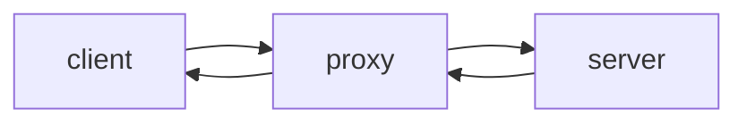

# HTTP 메시지

## 3.1 메시지의 흐름

- HTTP 메시지는 HTTP 어플리케이션 간에 주고받은 데이터의 블록들
- 이 데이터의 블록들은 메시지의 내용과 의미를 설명하는 텍스트 메타 정보로 시작하고 그 다음에 선택적으로 데이터가 올 수 있다.
- 메시지는 클라이언트, 서버, 프록스 사이를 흐른다.
- 메시지의 방향에 따라, '인바운드', '아웃바운드', '업스트림', '다운스트림' 으로 칭한다.

### 3.1.1 메시지는 원서버 방향을 인바운드로 하여 송신된다

- HTTP는 인바운드와 아웃바운드라는 용어를 트랜잭션 방향을 표현하기 위해 사용한다.
- 메시지가 원 서버로 향하는 것은 인바운드로 이동하는 것이고 --> 요청
- 모든 처리가 끝난 뒤에 메시지가 사용자 에이전트로 돌아오는 것은 아웃바운드로 이동하는 것 이다. --> 응답

### 3.1.2 다운스트림으로 흐르는 메시지

- HTTP 메시지는 모두 다운스트림으로 흐른다.
- 메시지의 발송자는 수신자의 업스트림이다.
  - 요청(클라이언트 -> 서버) 일 때, 클라이언트는 서버의 업스트림
  - 응답(서버 -> 클라이언트) 일 때, 서버는 클라이언트의 업스트림

## 3.2 메시지의 각 부분

- HTTP 메시지는 단순한, 데이터의 구조화된 블록
- 메시지는 클라이언트로부터의 요청이나 서버로부터의 응답 중 하나를 포함한다.
- 메시지는 시작줄, 헤더 블록, 본문 세부분으로 구성된다.
  - 시작줄: 어떤 메시지인지 서술
  - 헤더: 속성
  - 본문: 데이터 (옵셔널)
- 시작줄과 헤더는 줄 단위로 분리된 아스키 문자열, 캐리지 리턴과 개행 문자로 구성된 두 글자의 줄바꿈 문자열으로 끝난다.
- 이 줄바꿈 문자열은 CRLF 라고 쓴다.
- 본문은 텍스트나 이진 데이터를 포함할 수 도 있고, 비어 있을 수 도 있다.

### 3.2.1 메시지 문법

- 모든 HTTP 메시지는 요청 메시지나 응답 메시지로 분류된다.
- 요청 메시지는 웹 서버에 어떤 동작을 요구한다.
- 응답 메시지는 요청의 결과를 클라이언트에게 돌려준다.

```text
# 요청 메시지

<메서드><요청 URL><버전>
<헤더>

<엔터티 본문>

ex)
GET /some/dir/url/file.png HTTP/1.0
Host: www.some-page.com

# 응답 메시지

<버전><상태 코드><사유 구절>
<헤더>

<엔터티 본문>

ex)
HTTP/1.0 200 OK
Content-Type: image/png
Content-length: 4000
```

- 메서드: 클라이언트 측에서 서버가 리소스에 대해 수행해주길 바라는 동작
- 요청URL: 요청 대상이 되는 리소스를 지칭하는 완전한 URL, URL의 경로 구성요소
- 버전: 메시지에서 사용중인 HTTP의 버전
- 상태코드: 요청 중에 일어난 일에 대한 설명을 나타내는 숫자
- 사유구절: 숫자로 된 상태 코드의 짧은 설명 문구
- 헤더: CRLF 이전에 나타나는 0개 이상의 값
- 본문: 임의의 데이터 블록(옵셔널)

### 3.2.2 시작줄

- 모든 HTTP 메시지는 시작줄로 시작한다.
- 요청 메시지의 시작줄은 무엇을 해야 하는지 말해준다.
- 응답 메시지의 시작줄은 무슨일이 일어 났는지 말해준다.

- 요청줄
  - 요청 메시지는 서버에게 리소스에 대해 무언가를 해달라고 부탁한다.
  - 서버에서 어떤 동작일이 일어나야 하는지 설명해주는 메서드와 그 동작에 대한 대상을 지칭하는 요청 URL이 들어있다.
  - 클라이언트가 어떤 HTTP 버전으로 말하고 있는지 서버에게 알려주는 HTTP 버전도 포함한다.

- 응답줄
  - 응답 메시지는 수행 결과에 대한 상태 정보와 결과 데이터를 클라이언트에게 돌려준다.
  - HTTP의 버전, 숫자로 된 상태 코드, 수행 상태에 대해 설명해주는 텍스트로 된 사유 구절이 들어 있다.

- 메서드
  - 요청의 시작줄은 메서드로 시작한다. 서버에게 무엇을 해야 하는지 말해준다.

- 상태 코드
  - 클라이언트에게 무엇이 일어났는지 말해준다.
  - 응답의 시작줄에 위치한다.
  - 세 자리 숫자로 된 코드값ㅐ
  - 200 ~ 299: 성공, 300 ~ 399: 리소스가 이동됨, 400 ~ 499: 요청 오류, 500 ~ 599: 서버 오류

- 사유 구절
  - 응답 시작줄의 마지막 구성요소
  - 상태 코드에 대한 글로 된 설명
  - OK, Not Found, Redirect

- 버전 번호
  - HTTP/x.y 형식으로 요청과 응답 메시지 양쪽 모두에 기술된다.
  
### 3.2.3 헤더

- 0개 혹은 여러개로 구성된 값
- 요청과 응답 메시지에 대한 추가 정보
- 키, 밸류 한쌍

- 일반 헤더: 요청,응답 모두 나타날 수 있음
- 요청 헤더: 요청에 대한 부가 정보
- 응답 헤더: 응답에 대한 부가 정보
- Entity 헤더: 본문 크기와 콘텐츠, 혹은 리소스 그 자체를 서술
- 확장 헤더: 명세에 정의되지 않은 새로운 헤더

### 3.2.4 엔티티 본문

- HTTP 메시지의 화물 (옵셔널)

### 3.2.5 버전 0.9 메시지

- 요청: 메서드와 요청 URL만 가지고 있다.
- 응답: 엔터티로만 되어 있따.

## 3.3 메서드

### 안전한 메서드(Safe Method)

- GET, HEAD 메서드는 서버에 어떤 변화를 주지 않음 -> 그래서 안전한 메서드

### 3.3.2 GET

- 서버에 리소스를 요청하기 위한 메소드

```sh
# Request
GET /some/dir/index.html HTTP/1.1
Host: www.some-page.com
Accept: *

# Resposne
HTTP/1.1 200 OK
Content-Type: text/html
Context-length: 617

<html>
...
```

### 3.3.3 HEAD

- GET처럼 행동하지만, 서버는 응답으로 헤더만 준다
- 엔터티 본문은 반환되지 않는다.
- 리소스를 가져오지 않고도 그에 대해 무엇인가를 알아 낼 수 있다.
- 응답의 상태 코드를 통해, 개체가 존재하는지 확인 할 수 있다.
- 헤더를 확인하여 리소스가 변겨오디었는지 검사할 수 있다.

```sh
# Request
HEAD /some/dir/index.html HTTP/1.1
Host: www.some-page.com
Accept: *

# Resposne
HTTP/1.1 200 OK
Content-Type: text/html
Context-length: 617
```

### 3.3.4 PUT

- 서버에 문서를 작성한다. (추가한다.)

```sh
# Request
PUT /some/dir/index.html HTTP/1.1
Host: www.some-page.com
Content-Type: text/plain
Content-length: 34

# Resposne
HTTP/1.1 201 Created 
Content-Type: text/plain
Content-length: 34

http://www.som-page.com/list.txt
```

### 3.3.5 POST

- 서버에 입력 데이터를 전송

```sh
# Request
POST /login HTTP/1.1
Host: www.some-page.com

{id:'zerochae',pw:1234}

# Resposne
HTTP/1.1 200 OK 
Content-Type: text/plain

'login success'
```

### 3.3.6 TRACE

- 요청이 서버에 도달했을 때 어떻게 보이게 되는지 알려준다.
- 주로 진단을 위해 사용한다.
- 요청이 의도한 요청/응답 과정을 거쳐가는지 검사할 수 있다.
- 프록시나 다른 어플레케이션이 요청에 어떤 영향을 미치는지 확인할 수 있다.
- 엔티티 본문을 보낼 수 없음. 서버가 받은 요청이 그대로 있다.



```sh
# Request (client -> proxy)
TRACE /list.txt HTTP/1.1
Host: www.some-page.com
Accept: *

# Request (proxy -> server)
TRACE /list.txt HTTP/1.1
Host: www.some-page.com
Accept: *
Via: 1.1 proxy.com

# Resposne (server -> proxy)
HTTP/1.1 200 OK 
Content-Type: text/plain
Content-length: 96

TRACE /list.txt HTTP/1.1
Host: www.some-page.com
Accept: *
Via: 1.1 proxy.com

# Resposne (proxy -> client)
HTTP/1.1 200 OK 
Content-Type: text/plain
Content-length: 96
Via: 1.1 proxy.com

TRACE /list.txt HTTP/1.1
Host: www.some-page.com
Accept: *
Via: 1.1 proxy.com
```

### 3.3.7 OPTIONS

- 서버에게 여러 가지 종류의 지원 범위에 대해 물어본다.
- 서버에게 특정 리소스에 대해 어떤 메서드가 지원되는지 물어볼 수 있다.

```sh
# Request
OPTIONS * HTTP/1.1
Host: www.some-page.com
Accept: *

# Resposne
HTTP/1.1 200 OK 
Allow: GET, POST, PUT, OPTIONS
```

### 3.3.8 DELETE

- URL에 해당하는 리소스를 삭제 요청한다.

```sh
# Request
DELETE /list.txt HTTP/1.1
Host: www.some-page.com

# Resposne
HTTP/1.1 200 OK 
Content-Type: text/plain

'delete success'
```

### 3.3.9 확장 메서드

- HTTP/1.1 명세에 정의되지 않은 메서드
- LOCK, MKCOL, COPY, MOVE ..

## 3.4 상태 코드

### 3.4.1 100-199: 정보성 상태 코드

- 100 Continue
  - 요청의 시작 부분 일부가 받아들여졌으며, 클라이언트는 나머지를 계속 이어어 보내야 함

```sh
# Request
POST /upload HTTP/1.1
Host: some.page 

# Response
HTTP/1.1 100 Continue
Date: Tue, 28 Apr 2024 12:00:00 GMT
```

- 101 Switching Protocols
  - 클라이언트가 Upgrade 헤더에 나열한 것 중 하나로, 서버가 프로토콜을 바꾸었음을 의미한다.

```sh
# Request
GET /some/dir HTTP/1.1
Connection: Upgrade
Upgrade: websocket

# Response
HTTP/1.1 101 Switching Protocols
Upgrade: websocket
Connection: Upgrade
```

### 3.4.2 200-299: 성공 상태 코드

- 200 OK
- 201 Created
- 202 Accepted
- 203 Non-Authoritative Information
- 204 No Content
- 205 Reset Content
- 206 Partial Content

### 3.4.3 300-399: 리다이렉션 상태 코드

- 요청한 리소스에 대한 위치 제공 혹은 다른 대안 응답
- 요청한 리소스가 이동되었다면, 그 위치를 제공 (Location 헤더)
- 300 Multiple Choices
- 301 Moved Permanently
- 302 Found
- 303 See Other
- 304 Not Modifed
- 305 Use Proxy
- 307 Temporary Redirect

```sh
# Request
GET /some/dir/index.html HTTP/1.1
Host: www.some.page

# Response
HTTP/1.1 301 OK 
Location: http://www.another-page.com

# Request (If-Modified-Since)
GET /some/dir/index.html HTTP/1.1
Host: www.some.page
If-Modified-Since: some date...

# Response
HTTP/1.1 304 Not Modified 
...
```

### 3.4.4 400-499: 클라이언트 에러 상태 코드

- 400 Bad Request
- 401 Unauthorized
- 402 Payment Required
- 403 Forbidden
- 404 Not Found
- 405 Method Not Allowed
- 406 Not Acceptable
- 407 Proxy Authentication Required
- 408 Request Timeout
- 409 Conflict
- 410 Gone
- 411 Length Required
- 412 Precondition Failed
- 413 Request Entity Too Lage
- 414 Request URI Too Long
- 415 Unsupported Media Type
- 416 Requested Range Not Satisfiable
- 417 Expectation Failed

### 3.4.5 500-599: 서버 에러 상태 코드

- 500 Internal Server Error
- 501 Not Implemented
- 502 Bad Gateway
- 503 Service Unavailable
- 504 Gateway Timeout
- 505 HTTP Version Not Supported

## 3.5 헤더

- 조건부 요청 헤더
  - Expect
  - If-match
  - If-Modified-Since
  - If-None-Match
  - If-Range
  - If-Unmodifed-Since
  - Range

```sh
POST /resource HTTP/1.1
Host: example.com
Expect: 100-continue
Content-Length: 10

GET /resource HTTP/1.1
Host: example.com
If-Match: "abc123"

GET /resource HTTP/1.1
Host: example.com
If-Range: "abc123"
Range: bytes=0-499

GET /resource HTTP/1.1
Host: example.com
Range: bytes=0-499
  ```
