# 04. 커넥션 관리

## 4.1 TCP 커넥션

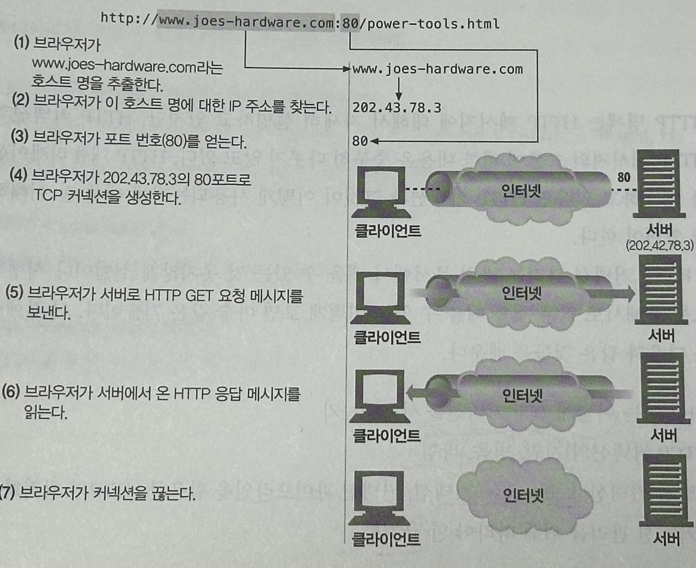

### 4.1.1 신뢰할 수 있는 데이터 전송 통로인 TCP

TCP는 HTTP에게 신뢰할 만한 통신 방식을 제공하며, 순서에 맞게 정확히 전달된다.

### 4.1.2 TCP 스트림은 세그먼트로 나뉘어 IP 패킷을 통해 전송된다

TCP는 `IP 패킷(혹은 IP 데이터그램)`이라고 불리는 작은 조각을 통해 데이터를 전송한다.

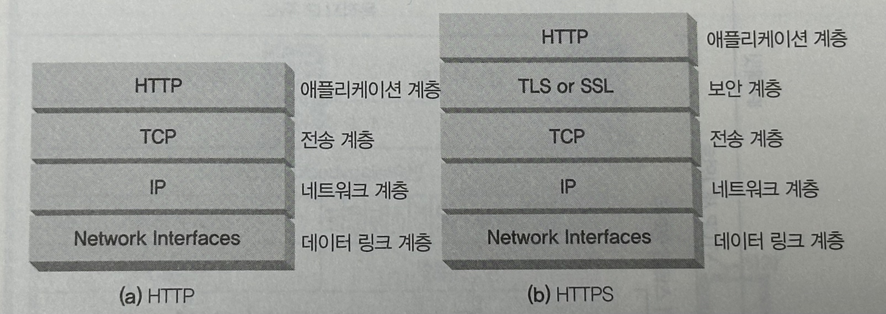

HTTP는 그림과 같이 `IP`, `TCP`, `HTTP`로 구성된 `프로토콜 스택`에서 최상위 계층이다.

여기에 HTTPS는 암호화(cryptographic encryption) 계층인 TLS(SSL)가 추가된 것이다.

HTTP가 메시지를 전송하고자 할 경우,

현재 연결된 TCP 커넥션을 통해서 메시지 데이터의 내용을 순서대로 보낸다.

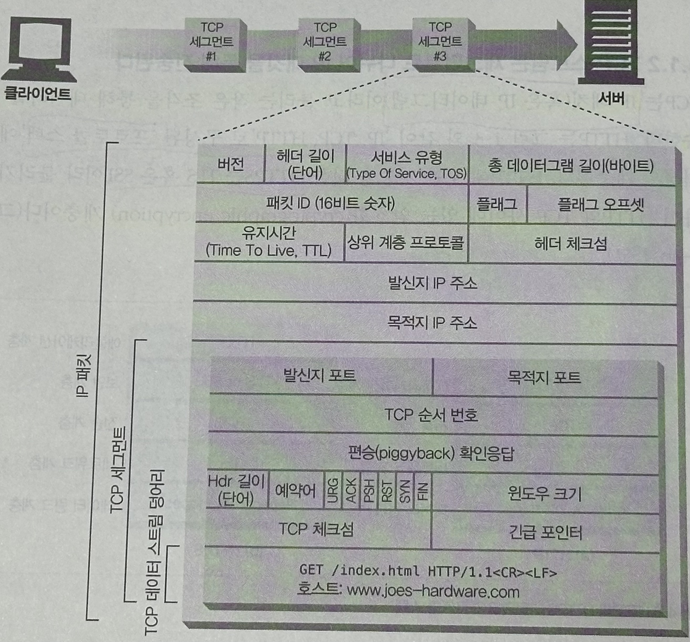

TCP는 세그먼트 단위로 데이터 스트림을 잘게 나누고, IP 패킷에 담아서 인터넷을 통해서 데이터를 전달한다.

각 TCP 세그먼트는 하나의 IP 주소에서 다른 IP 주소로 IP 패킷에 담겨 전달된다.

IP 패킷들은 각각 아래 3가지를 포함한다.

- IP 헤더 : 발신자와 목적지 IP 주소, 크기, 기타 플래그를 가짐.
- TCP 세그먼트 헤더 :  TCP 포트 번호, TCP 제어 플래그
- TCP 데이터 조각 : 데이터의 순서와 무결성 검사를 위해 사용되는 숫자 값

### 4.1.3 TCP 커넥션 유지하기

컴퓨터는 항상 TCP 커넥션을 여러 개 가지고 있으며, TCP는 포트 번호를 통해서 여러 개의 커넥션을 유지한다.

TCP 커넥션은 **네 가지 값으로 식별**하며, 구성요소 일부가 같을 수는 있으나 `모든 값이 같을 수는 없다.`

```
<발신자 IP 주소, 발신자 포트, 수신자 IP 주소, 수신자 포트>
```

- 예제
    
    
    | 커넥션 | 발신자 IP 주소 | 발신자 포트 | 목적지 IP 주소 | 목적지 포트 |
    | --- | --- | --- | --- | --- |
    | A | 209.1.32.34 | 2034 | 204.62.128.58 | 4133 |
    | B | 209.1.32.35 | 3227 | 204.62.128.58 | 4140 |
    | C | 209.1.32.35 | 3105 | 207.25.71.25 | 80 |
    | D | 209.1.33.89 | 5100 | 207.25.71.25 | 80 |
    
    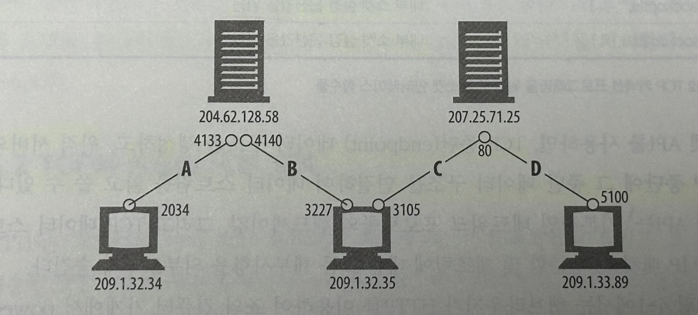
    

### 4.1.4 TCP 소켓 프로그래밍

- TCP 커넥션 프로그래밍을 위한 공통 소켓 인터페이스 함수들
    
    
    | 소켓 API 호출 | 설명 |
    | --- | --- |
    | s = socket(<parameters>) | 연결이 되지 않은익명의 새로운 소켓 생성 |
    | binds(s, <local IP:port>) | 소켓에 로컬 포트 번호와 인터페이스 할당 |
    | connect(s, <remote IP:port>) | 로컬의 소켓과 원격의 호스트 및 포트 사이에 TCP 커넥션 생성 |
    | listen(s…) | 커넥션을 받아들이기 위해 로컬 소켓에 허용함을 표시 |
    | s2 = accept(s) | 로컬 포트에 커넥션을 맺기를 기다림 |
    | n = read(s, buffer, n) | 소켓으로부터 버퍼에 n바이트 읽기 시도 |
    | n = write(s, buffer, n) | 소켓으로부터 버퍼에 n바이트 쓰기 시도 |
    | close(s) | TCP 커넥션을 완전히 끊음 |
    | shutdown(s, <side>) | TCP 커넥션의 입출력만 닫음 |
    | getsockopt(s, …) | 내부 소켓 설정 옵션값을 읽음 |
    | setsockopt(s, …) | 내부 소켓 설정 옵션값을 변경 |
- 소켓 API를 사용하면, TCP 종단 데이터 구조를 생성하고, 원격 서버의 TCP 종단에 그 종단 데이터 구조를 연결하여 데이터 스트림을 읽고 쓸 수 있다.
- 기본적인 네트워크 프로토콜의 핸드셰이킹, TCP데이터 스트림, IP패킷간의 분할 및 재조립에 대한 모든 내용을 외부로부터 숨긴다.
- 클라이언트와 서버 간에 HTTP 트랜잭션을 수행하기 위한 소켓 API 사용방법

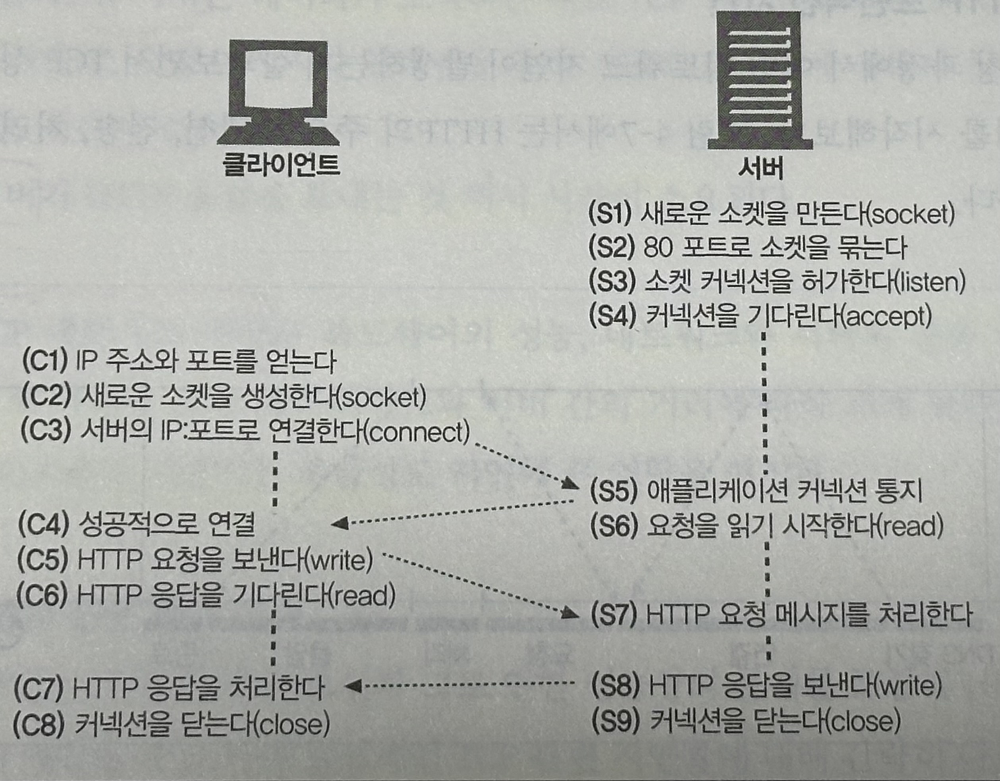

1. 웹 서버는 커넥션을 기다리기 시작
2. 클라이언트는 URL에서 IP 주소와 포트 번호르 알아내고 서버에 TCP 커넥션을 생성
    - `커넥션 생성`은 **서버와의 거리, 서버의 부하, 인터넷 혼잡도에 따라서 시간이 걸린다.**
3. 커넥션이 맺어지면 클라이언트는 HTTP 요청을 보냄
4. 서버는 해당 요청을 읽음
5. 요청 메시지를 다 받으면, 요청을 분석하여 클라이언트가 원하는 동작 수행
6. 클라이언트에게 데이터를 보낸다.
7. 클라이언트는 받아서 응답 데이터를 처리한다.

---

## 4.2 TCP의 성능에 대한 고려

### 4.2.1 HTTP 트랜잭션 지연

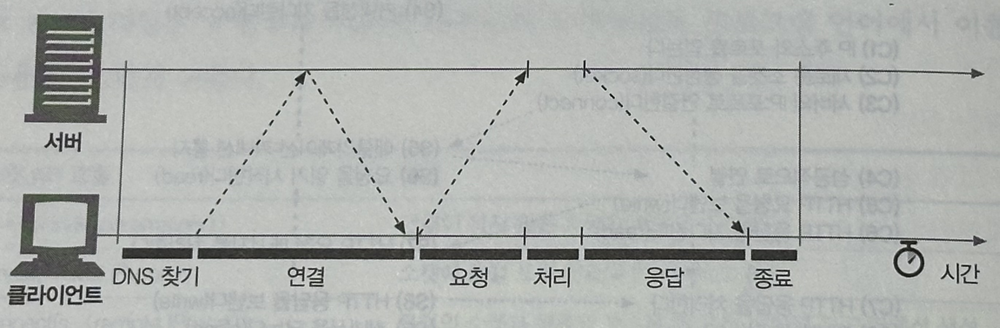

- **`트랜잭션을 처리하는 시간`**이 **TCP 커넥션 설정, 요청 전송, 응답 메시지 전송**에 비해 상당히 짧음.
- HTTP 트랜잭션 지연은 대부분 `TCP 네트워크 지연`때문에 발생한다
    1. `클라이언트`는 URI에서 **웹 서버의 IP 주소**와 **포트 번호를** 알아내야 한다.
        - 만약 호스트에 방문한 적이 최근에 없으면(캐시가 없을 경우), DNS 인프라를 사용하여 **IP 주소로 변환**하는데 수십 초(현재는 밀리초 단위)의 시간이 걸릴 것이다.
    2. `클라이언트`는 **TCP 커넥션 요청**을 서버에게 보내고, 서버가 **커넥션 허가 응답을 회신하기를 기다린다**.
        - 커넥션 설정 시간은 **새로운 TCP 커넥션에서 항상 발생**한다.
    3. 커넥션이 맺어지면 `클라이언트`는 **HTTP 요청을 새로 생성한 TCP 파이프를 통해 전송**한다.
        - `웹 서버`는 **데이터가 도착하는 대로** TCP 커넥션에서 **요청 메세지를 읽고 처리**한다.

### 4.2.2 성능 관련 중요 요소

가장 일반적인 TCP 관련 지연들

1. TCP 커넥션의 **핸드셰이크 설정**
2. 인터넷의 혼잡을 제어하기 위한 **TCP의 느린 시작 (slow-start)**
3. 데이터를 한데 모아 한 번에 전송하기 위한 **네이글(nagle) 알고리즘**
4. TCP **편승(piggyback) 확인 응답(acknowledgment)을 위한** **확인 응답 지연 알고리즘**
5. **TIME_WAIT 지연과 포트 고갈**

### 4.2.3 TCP 커넥션 핸드셰이크 지연

새로운 TCP 커넥션을 열 때면, TCP 소프트웨어는 커넥션을 맺기 위한 **조건을 맞추기 위해 연속으로 IP 패킷을 교환**한다.

→ 작은 크기의 데이터 전송에 커넥션이 사용된다면 성능 저하가 발생.

- TCP 커넥션이 핸드셰이크를 하는 순서
    
    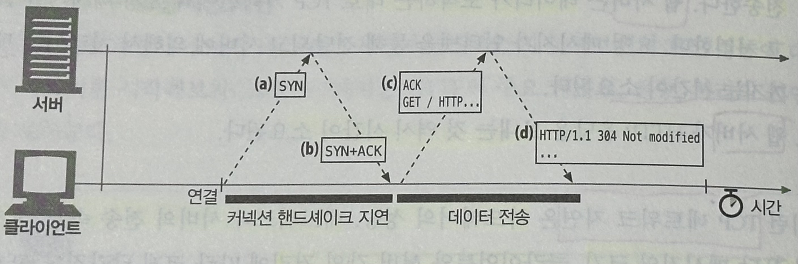
    ```
    (a) 커넥션 생성 요청
    
    (b) 커넥션 요청이 받아들여짐
    
    (c) 클라이언트의 확인 응답 + 실제 요청 데이터
    
    (d) 응답
    ```
    
    1. `클라이언트`는 새로운 TCP 커넥션을 생성하기 위해 **작은 TCP 패킷**을 서버에게 보낸다.
        - 패킷은 SYN(**syn**chronize sequence numbers)라는 특별한 플래그를 가진다.(**커넥션 생성 요청이라는 뜻)**
    2. `서버`가 커넥션을 받으면, 받아들여졌음을 의미하는 `SYN` + `ACK` 플래그를 포함한 TCP 패킷을 클라이언트에게 보낸다.
    3. 마지막으로 `클라이언트`는 커넥션이 잘 맺어졌음을 알리기 위해, 서버에게 다시 확인응답 신호를 보낸다. (ACK)
        - 오늘의날 TCP는 확인응답 패킷과 함께 데이터를 보낼 수 있다.
    - HTTP 프로그래머가 보는 것은 TCP 커넥션이 생성될 때 발생하는 지연이 전부
    - 보통은 `SYN / SYN+ACK 핸드셰이크`가 눈에 띄는 지연을 발생시킨다.
        - TCP의 ACK 패킷은 HTTP 요청 메세지 전체를 전달할 수 있을 만큼 큰 경우가 많고, HTTP 서버 응답 메세지는 하나의 IP 패킷에도 담길 수 있기 때문.
    - 크기가 작은 HTTP 트랜잭션은 50% 이상의 시간을 **TCP를 구성**하는 데 쓴다.

### 4.2.4 확인응답 지연

- TCP 세그먼트는 `순번`과 `데이터 무결성 체크섬`을 가진다.
- 세그먼트의 수신자는 **세그먼트를 온전히 받으면 작은 확인응답 패킷을 송신자에게 반환**한다.
    
    송신자가 특정 시간 안에 이 확인응답 메시지를 받지 못하면, 패킷이 중간에 파기되었거나 오류가 있는 것으로 판단하고 재전송한다.
    
- 확인응답은 **크기가 작기 때문에**, TCP는 같은 **방향으로 송출되는 데이터 패킷에 확인응답을 편승(piggyback)시킨다.**
    
    → TCP 스택은 piggyback을 늘리기 위해 `확인응답 지연 알고리즘`을 구현한다.
    
- **확인응답 지연**
    
    송출할 확인응답을 **특정 시간 동안(보통 0.1~0.2초) 버퍼에 저장**해두고, 확인응답을 **편승시키기 위한 송출 데이터 패킷을 찾는다**.
    
    송출 패킷을 찾지 못하면 `별도 패킷`을 만들어 전송된다.
    
- 요청과 응답 두 가지 형식으로만 이루어지는 HTTP 동작 방식은, 확인 응답이 송출 데이터 패킷에 편승할 기회를 감소시켜, 오히려 지연이 자주 발생한다.
    - 운영체제에 따라 다르지만, 확인응답 지연 관련 기능을 수정하거나 비활성화할 수 있다.
    - 단, TCP 스택에 있는 매개변수를 수정할 때는 **잘 알고 수정하자**.

### 4.2.5 TCP 느린 시작(slow start)

TCP의 데이터 전송 속도는 TCP 커넥션이 만들어진 지 얼마나 지났는지에 따라 달라질 수 있다.

- **TCP 느린 시작**
    - 시간이 지나면서 자체적으로 튜닝되어서, `처음`에는 **커넥션의 최고속도를 제한**하고 `데이터가 성공적으로 전송됨`에 따라서 **속도 제한을 높여나가며 조율하는 것.**
    - 갑작스러운 부하와 혼잡을 방지하는 데 쓰인다.
    - TCP가 한번에 전송할 수 있는 패킷 수를 제한하고, 패킷이 성공적으로 전달되는 시점에 송신자는 추가로 2개의 패킷을 더 전송할 수 있는 권한을 얻는다. 이를 `혼잡 윈도를 연다 (opening the congestion window)`라고 표현
    - 이로인해, 새로운 커넥션은 이미 어느정도 데이터를 주고받은 튜닝된 커넥션보다 느리다.

### 4.2.6 네이글(Nagle) 알고리즘과 TCP_NODELAY

TCP는 어떤 크기의 데이터든지 TCP 스택으로 전송할 수 있도록 `데이터 스트림 인터페이스`를 제공하지만,

각 TCP 세그먼트는 40바이트 상당의 플래그와 헤더를 포함하여 전송하기 때문에, 작은 크기의 데이터를 포함한 많은 수의 패킷을 전송하면 네트워크 성능은 크게 떨어지게 된다.

- **네이글 알고리즘**
    
    패킷을 전송하기 전에 많은 양의 TCP 데이터를 한 개의 덩어리로 합친다.
    
    - 세그먼트가 최대 크기가 되지 않으면 전송을 하지 않는다.
    - 다만 다른 모든 패킷이 확인응답을 받았을 경우에는 최대 크기보다 작은 패킷의 전송을 허락한다.
    
    **문제점**
    
    1. 앞으로 생길지 생기지 않을지 모르는 데이터를 계속 기다리며 지연될 수 있다.
    2. 확인응답 지연과 같이 쓰일 경우 형편없이 동작
        - 네이글 알고리즘은 확인응답이 도착할 때까지 데이터 전송을 멈추는 반면, 확인응답 지연 알고리즘은 확인응답을 100~200밀리초 지연시킴
        - HTTP 애플리케이션은 성능 향상을 위해서 `TCP_NODELAY 파라미터` 값을 설정해서 네이글 알고리즘을 비활성화할 수 있다.

### 4.2.7 TIME_WAIT의 누적과 포트 고갈

`성능 측정 시`에 **심각한 성능 저하를 발생**시키나, **`보통 실제 상황`에서는 문제를 발생시키지 않는다.**

- TCP 커넥션을 끊으면, 종단에서는 커넥션의 IP 주소와 포트 번호를 메모리의 작은 제어영역(control block)에 기록해둔다.
- 이 정보는 같은 주소와 포트 번호를 사용하는 **새로운 TCP 커넥션이 일정 시간 동안 생성되지 않게 하기 위한 것**.
    
    (보통 세그먼트의 최대 생명주기의 두 배 정도로 설정되며 `2MSL(2분 정도)`지만, 현재는 훨씬 짧아짐. )
    
- 이전 커넥션과 관련된 패킷이 같은 주소와 포트 번호를 가지는 새로운 커넥션에 삽입되는 문제를 방지.
- 이런 커넥션 종료 지연은 평상시에는 큰 문제가 되지 않지만, 성능시험을 하는 상황에서는 문제가 될 수도 있다.
    - `IP 주소의 개수 제한` 및 `부하를 발생시킬 컴퓨터의 수`가 적고, `기본 포트인 80번을 사용`하기 때문에, **가능한 연결의 조합이 제한되어 재활용하는 것이 불가능**해짐
- 포트 고갈 문제를 겪지 않더라도, **커넥션을 너무 많이 맺거나 대기 상태로 있는 제어 블록이 너무 많아지는 상황은 주의.**

---

## 4.3 HTTP 커넥션 관리

### 4.3.1 흔히 잘못 이해하는 Connection 헤더

HTTP Connection 헤더 필드는 커넥션 토큰을 `쉼표`로 구분하여 가지고 있으며, 그 값들은 다른 커넥션에 전달되지 않는다.

Connection 헤더에는 다음 세 가지 종류의 토큰이 전달될 수 있다.
```
- HTTP 헤더 필드 명 : 이 커넥션에만 해당하는 헤더들을 나열
- 임시적인 토큰 값 : 커넥션에 대한 비표준 옵션을 의미
- close 값 : 커넥션 작업이 완료되면 종료되어야 함을 의미
```

- HTTP 헤더 필드 명을 가지고 있다면, 현재 커넥션만을 위한 정보이기 때문에, **다음 커넥션으로 전달하면 안 된다**.
- Connection 헤더에는 `홉별(hop-by-hop) 헤더명`을 기술하기에 이것을 `헤더 보호하기` 라고 한다.
- Connection 헤더에 있는 모든 헤더 필드는 **메시지를 다른 곳으로 전달하는 시점**에 `삭제` 되어야 한다.
- Connection 헤더에 기술되지 않더라도 홉별 헤더인 것 : `Proxy-Authenticate`, `Proxy-Connection`, `Transfer-Encoding`, `Upgrade`

### 4.3.2 순차적인 트랜잭션 처리에 의한 지연

커넥션 관리가 제대로 이루어지지 않으면 TCP 성능이 매우 안 좋아질 수 있다.

- 만약 3개의 이미지가 있는 웹페이지에 접근한다면, `총 4개`의 HTTP 트랜잭션을 만들어야 함. (HTML + 이미지 3개)
    - 만약 각 트랜잭션이 새로운 커넥션을 필요로 한다면, **커넥션을 맺는데 발생하는 지연과 함께 느린 시작 지연이 발생할 것이다.**
    
    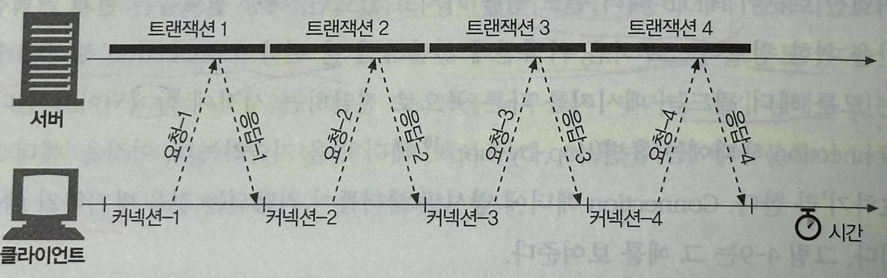
    
- 순차처리로 인한 지연에는 **물리적인 지연**뿐 아니라, **심리적인 지연(**하나의 이미지를 내려받고 있는 중에는 웹페이지의 나머지 공간에 아무런 변화가 없어서 느껴지는**)**도 있다.

HTTP 커넥션의 성능을 향상시킬 수 있는 여러 최신 기술이 있다.

- **병렬(parallel) 커넥션** : 여러 개의 TCP 커넥션을 통한 **`동시** HTTP 요청`
- **지속(persistent) 커넥션** : 커넥션을 맺고 끊는 데서 발생하는 지연을 제거하기 위한 `TCP 커넥션의 **재활용**`
- **파이프라인(pipelined) 커넥션** : **공유 TCP 커넥션**을 통한 `병렬 HTTP 요청`
- **다중(multiplexed) 커넥션** : 요청과 응답들에 대한 **`중재`** (실험적인 기술)

---

## 4.4 병렬 커넥션

HTTP 클라이언트가 여러 개의 커넥션을 맺을으로써, 여러 개의 HTTP 트랜잭션을 병렬로 처리할 수 있게 한다.

### 4.4.1 병렬 커넥션은 페이지를 더 빠르게 내려받는다

단일 커넥션의 `대역폭 제한`과 `커넥션이 동작하지 않고 있는 시간`을 활용하면, **객체가 여러 개 있는 웹페이지를 더 빠르게 내려받을 수 있다.**

- 각 커넥션의 **지연 시간을 겹치게 해서** `총 지연 시간 줄이기`
- 클라이언트의 인터넷 대역폭을 하나의 커넥션이 다 써버리는 것이 아니라면 나머지 객체를 내려받는 데에 `남은 대역폭을 사용`할 수 있다

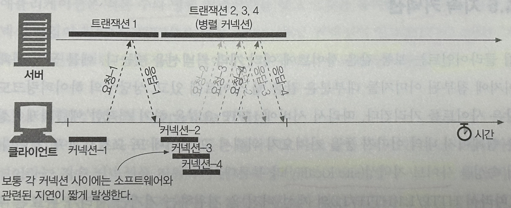

### 4.4.2 병렬 커넥션이 항상 더 빠르지는 않다

- **네트워크 대역폭이 좁을 때**
    - 대부분 시간을 `데이터 전송`에만 사용.
    - **제한된 대역폭 내에서 각 객체를 전송받는 것은 느리기 때문**에 성능상의 장점이 거의 없어지고, **더 느릴 수도 있다.** → 여러 개의 커넥션 생성에서 생기는 부하로 인해.

- **다수의 커넥션**
    - 메모리를 많이 소모하고 자체적인 성능 문제를 발생시킴.
    - 복잡한 웹페이지는 수십 개에서 수백 개의 객체를 포함하기는 하지만, 그렇다고 해서 **브라우저가 수백 개의 커넥션을 허용하지 않는다.**
        - 다른 여러 사용자의 요청도 함께 처리해야 하기 때문에.
    - 브라우저는 실제로 병렬 커넥션을 사용하지만 6~8개의 병렬 커넥션만 혀용한다.
    - 서버는 과도한 수의 커넥션이 맺어졌을 경우, 임의로 끊어버릴 수 있다.

### 4.4.3 병렬 커넥션은 더 빠르게 ‘느껴질 수’ 있다

사용자는 화면 전체에서 여러 작업이 일어나는 것을 눈으로 확인할 수 있기에, 더 빠르다고 여긴다.

---

## 4.5 지속 커넥션

웹 클라이언트는 웹페이지 내의 여러 데이터를 가져오기 위해 같은 서버에 여러 번 요청을 하게 되는 경우가 많은데, 이 속성을 `사이트 지역성(site locality)`라고 부른다. 

따라서, HTTP/1.1을 지원하는 기기는 처리가 완료된 후에도 TCP 커넥션을 유지하여 앞으로 있을 HTTP 요청에 재사용할 수 있다.

처리가 완료된 후에도 계속 연결된 상태로 있는 TCP 커넥션을 `지속 커넥션` 이라고 부른다.

### 4.5.1 지속 커넥션 vs 병렬 커넥션

**병렬 커넥션의 단점**

- 각 트랜잭션마다 새로운 커넥션을 맺고 끊기에 시간과 대역폭 소요
- 각각의 새로운 커넥션은 TCP 느린 시작 때문에 성능 저하
- 병렬 커넥션의 수에 제한이 존재

**지속 커넥션 장점** 

- 커넥션을 맺기 위한 `사전 작업과 지연`을 줄여준다.
- `튜닝된 커넥션`(TCP 느린 시작에서, 패킷을 수차례 성공적으로 전송한 결과로 한 번에 다수의 패킷을 전송할 수 있는 권한을 얻은 상태의 커넥션)을 유지
- 커넥션 수를 줄여준다.

지속 커넥션은 병렬 커넥션과 `함께 사용될 때에 가장 효과적`이다.

지속 커넥션에는 두 가지 타입 `HTTP/1.0+에는 keep-alive 커넥션`, `HTTP/1.1에는 persistent 커넥션`이 있다.

### 4.5.2 HTTP/1.0+의 Keep-Alive 커넥션

- keep-alive 커넥션의 성능상 장점
    
    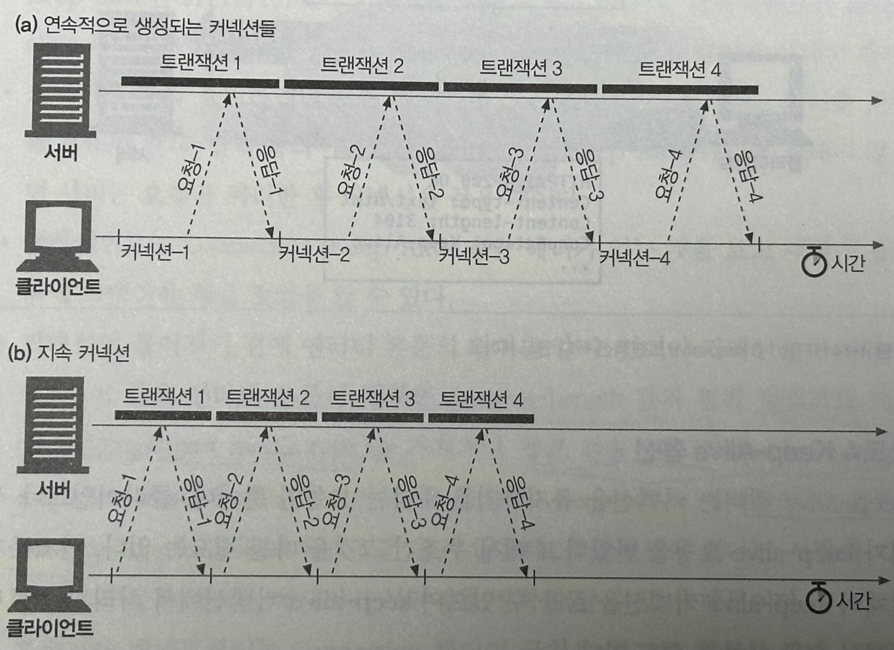
    
    커넥션을 맺고 끊는데 필요한 작업이 없어서 시간이 단축되었다.
    
    또한, TCP 느린 시작이 일어나지 않기 때문에 요청 및 응답 시간도 줄어든다.
    

### 4.5.3 Keep-Alive 동작

HTTP/1.0 keep-alive 커넥션을 구현한 클라이언트는 `Connection:Keep-Alive` 헤더를 포함시킨다.

서버는 그다음 요청도 유지를 하려면, 응답 메시지에 같은 헤더를 포함시켜 응답한다.

응답에 해당 헤더가 없으면, 클라이언트는 서버가 keep-alive 를 지원하지 않아서 응답 메시지가 전송되고 나면 커넥션을 끊을 것이라 추정한다.

### 4.5.4 Keep-Alive 옵션

`Keep-Alive 헤더`는 **커넥션을 유지하기를 바라는 요청일 뿐**이며, 서버가 무조건 따를 필요는 없다.

언제든 keep-alive **커넥션을 끊을 수 있고**, **처리되는 `트랜잭션 수를 제한`**할 수도 있다.

keep-alive 동작은 Keep-Alive 헤더의 쉽표로 구분된 옵션들로 제어할 수 있다.

```
Connection: Keep-Alive
Keep-Alive: max=5, timeout=120
```

- **timeout 파라미터** : 커넥션이 **얼마간 유지될 것**인지 의미. 동작 보장은 X
- **max 파라미터** : 커넥션이 **몇 개의 HTTP 트랜잭션을 처리할 때까지 유지될 것**인지 의미. 동작 보장은 X
- 진단이나 디버깅을 주목적으로 하는 임의의 속성들을 지원. 문법은 `이름=값 같은 식`

### 4.5.5 Keep-Alive 커넥션 제한과 규칙

- keep-alive는 HTTP/1.0에서 **기본으로 사용되지 않는다**. 사용하기 위해서는 `Connection: Keep-Alive 요청 헤더`를 보내야한다.
- 커넥션을 계속 유지하려면 **모든 메시지**에 `Connection: Keep-Alive 요청 헤더`를 포함해 보내야 한다.
- 엔터티 본문이 `정확한 Content-Length 값`과 함께 `멀티파트 미디어 형식(multipart media type)`을 가지거나, `청크 전송 인코딩(chunked transfer encoding)으로 인코드` 되어야 한다.
    
    → 기존 메시지의 끝과 새로운 메시지의 시작점을 정확히 알기 위함.
    
- 프락시와 게이트웨이는 메시지를 전달하거나 캐시에 넣기 전에 **Connection 헤더에 명시된 모든 헤더 필드와 Connection 헤더를 제거**해야 한다.
- keep-alive 커넥션은 **Connection 헤더를 인식하지 못하는 프락시 서버와는 맺어지면 안 된다.**
    
    → 멍청한(Dumb) 프락시로 인해 발생할 문제를 예방하기 위함.
    
- HTTP/1.0을 따르는 기기로부터 받은 **모든 Connection 헤더 필드는 무시해야 한다.**
    
    → 오래된 프락시 서버로부터 실수로 전달될 수 있기 때문
    
- 클라이언트는 응답 전체를 모두 받기 전에 **커넥션이 끊어진 경우**, **요청을 다시 보낼 수 있게 준비되어 있어야 한다.**
    
    → 요청이 반복될 경우 문제가 발생할 수 있다.
    

### 4.5.6 Keep-Alive와 멍청한(dumb) 프락시

- dumb 프락시를 거쳐 웹 서버에 미시지를 전송할 경우.

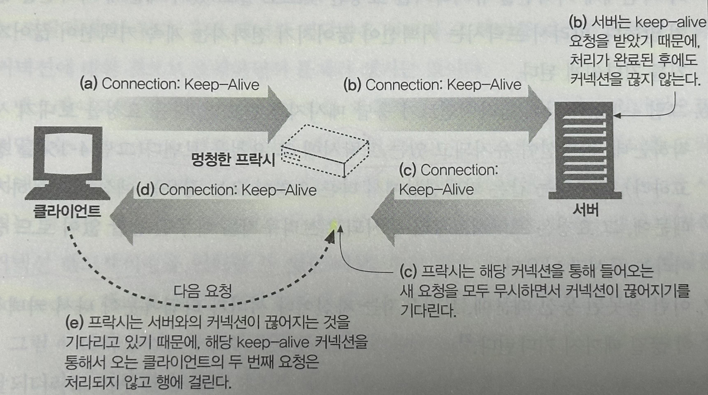

1. `웹 클라이언트`는 프락시에 `Connection: Keep-Alive 헤더`와 함께 메시지를 보내서 커넥션을 유지하기를 요청
2. dumb 프락시는 다음 서버에 메시지를 그대로 전달.
    
    → Connection 헤더는 홉별 헤더라서, 오직 한 개의 전송 링크에만 적용되며 다음 서버로 전달되어서는 안 된다.
    
3. 웹 서버는 프락시가 커넥션을 유지하고자 요청하는 것으로 잘못 판단하여, 프락시와 커넥션을 유지하는 것에 동의 → `웹 서버 ↔ 프락시 커넥션이 맺어짐`
4. dumb 프락시는 서버로부터 받은 `Connection: Keep-Alive 헤더` 를 포함한 응답 메시지를 클라이언트에게 전달. 클라이언트는 이 헤더를 통해 프락시가 커넥션을 유지하는 것에 동의했다고 추정한다.
    
    → `클라이언트 ↔ 프락시 커넥션이 맺어짐`
    
5. dumb 프락시는 서버가 커넥션을 끊기를 기다린다.(keep-alive를 모르기 때문에)
    
    하지만, 서버는 커넥션을 유지하기를 요청한 것으로 알기에 커넥션을 끊지 않아서, 프락시는 계속 대기하게 된다.
    
6. 클라이언트는 응답 메시지를 받았기에, 다음 요청을 보내기 위해 커넥션이 유지되고 있는 프락시에 요청을 보낸다.
    
    프락시는 같은 커넥션상에서 다른 요청이 오는 경우는 예상하지 못하기에, 해당 요청은 무시되어 브라우저는 아무런 응답 없이 로드 중 표시만 나온다.
    
7. 브라우저는 자신이나 서버가 타임아웃이 나서 커넥션이 끊길 때까지 기다린다.

**프락시와 홉별 헤더**

- 프락시는 Connection 헤더와 Connection 헤더에 명시된 헤더들은 절대 전달하면 안 된다.
- Connection 헤더의 값으로 명시되지 않는 홉별 헤더(`Proxy-Authenticate`, `Proxy-Connection`, `Transfer-Encoding`, `Upgrade`)들도 전달하거나 캐시하면 안 된다

### 4.5.7 Proxy-Connection 살펴보기

모든 웹 애플리케이션이 HTTP 최신 버전을 지원하지 않아도, 모든 헤더를 무조건 전달하는 문제를 해결할 수 있는 차선책은 `Proxy-Connection 헤더`를 사용하는 것이다.

`Proxy-Connection`은 프락시를 별도로 설정할 수 있는 현대의 브라우저들에서 지원하며, 많은 프락시도 인식한다.

Connection 헤더 대신 비표준인 `Proxy-Connection` 확장 헤더를 프락시에 전달하면, 프락시가 `Proxy-Connection` 헤더를 전달하더라도, 웹 서버는 **무시**하기 때문에 별문제가 되지 않는다. 

하지만 `영리한 프락시(지속 커넥션을 이해하는)`라면, **의미 없는 Proxy-Connection 헤더를 Connection 헤더로 바꿈으로써 원하던 효과를 얻을 수 있다.**

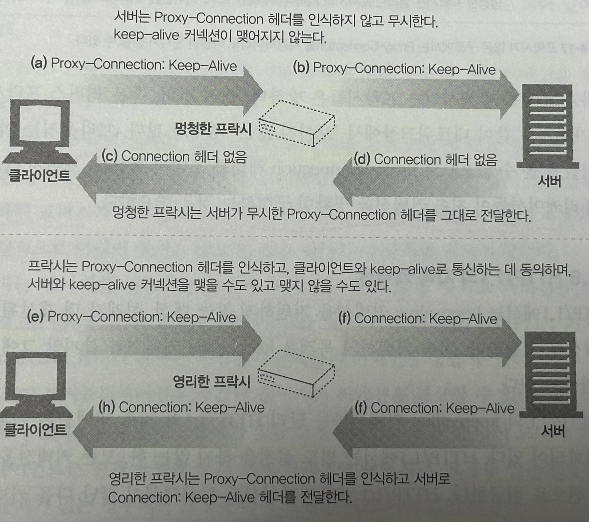

영리한 프락시는 Proxy-Connection 헤더가 keep-alive를 요청하는 것임을 인식하여, keep-alive 커넥션ㄴ을 맺기 위해 자체적으로 `Connection: Keep-Alive` 헤더를 웹 서버에 전송한다.

이 방식은 **클라이언트와 서버 사이에 `한 개의 프락시`만 있는 경우에만 동작**한다. 

멍청한 프락시의 양 옆에 영리한 프락시가 있다면 잘못된 헤더를 만들어내는 문제가 다시 발생한다.

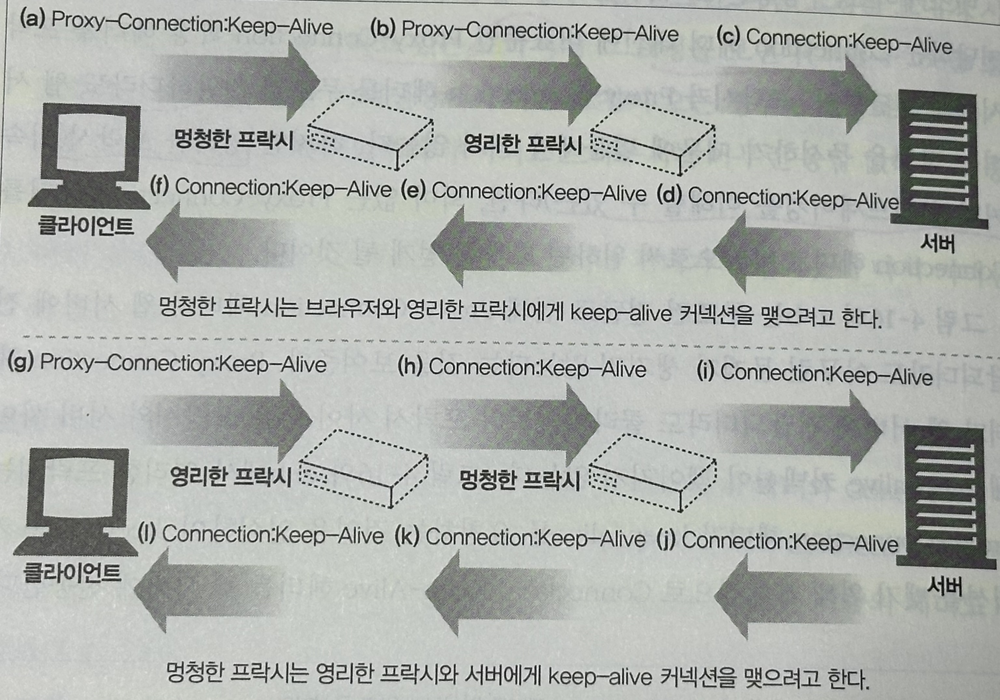

### 4.5.8 HTTP/1.1의 지속 커넥션

- HTTP/1.1은 keep-alive 커넥션을 지원하지 않는 대신, 설계가 개선된 `지속 커넥션`을 지원한다.
- HTTP/1.1에서 지속 커넥션은 `기본으로 활성화`되어있어, 별도 설정을 하지 않는 한, 모든 커넥션은 지속 커넥션으로 취급한다.
- HTTP/1.1 애플리케이션은 트랜잭션이 끝난 다음 커넥션을 끊으려면 `Connection: close` 헤더를 **명시**해야 한다.
- `Connection: close` 헤더를  보내지 않는 것이 **서버가 커넥션을 영원히 유지하겠다는 것을 뜻하지는 않는다.**

### 4.5.9 지속 커넥션의 제한과 규칙

- `Connection: close` 를 포함해 보냈으면, 클라이언트는 그 커넥션으로 추가 요청을 보낼 수 없다.
- 클라이언트는 추가 요청을 보내지 않을 것이라면, `Connection: close` 헤더를 보내야 한다.
- **모든 메시지가 자신의 길이 정보를 정확히 가지고 있을 때에만 커넥션을 지속**시킬 수 있다.
    
    → 엔티티 본문은 `정확한 Content-Length`를 가지거나 `청크 전송 인코딩으로 인코드`되어 있어야 한다.
    
- HTTP/1.1 프락시는 **클라이언트와 서버 각각에 대해 별도의 지속 커넥션을 맺고 관리**해야 한다.
- HTTP/1.1 프락시 서버는 **커넥션 관련 기능에 대한 클라이언트의 지원 범위**를 알고 있지 않은 한 지속 커넥션을 맺으면 안 된다.
    
    → 오래된 프락시가 Conenction 헤더를 전달하는 문제가 발생할 수 있기 때문.
    
- HTTP/1.1 기기는 **Connection 헤더의 값과는 상관없이 언제든지 커넥션을 끊을 수 있다.**
    
    → 서버는 중간에 끊지 않을 것이고, 끊기 전에 적어도 한 개의 요청에 응답을 할 것.
    
- HTTP/1.1 **애플리케이션은 중간에 끊어지는 커넥션을 복구할 수 있어야 한다.**
    
    → 클라이언트는 다시 보내도 문제가 없는 요청이라면 가능한 한 다시 보내야 한다.
    
- 클라이언트는 전체 응답을 받기 전에 커넥션이 끊어지면, 요청을 반복해서 보내도 문제가 없는 경우 다시 보낼 준비가 되어 있어야 한다.
- 클라이언트는 서버의 과부하를 방지하기 위해서, 넉넉잡아 2개의 지속 커넥션만을 유지.

---

## 4.6 파이프라인 커넥션

HTTP/1.1은 지속 커넥션을 통해 요청을 `파이프라이닝` 할 수 있다.

- 여러 개의 요청은 응답이 도착하기 전까지 큐에 쌓인다.
- 지속 커넥션이 어떻게 TCP 커넥션 지연을 제거하며, 파이프라인을 통한 요청이 어떻게 전송 대기 시간을 단축시키는지.

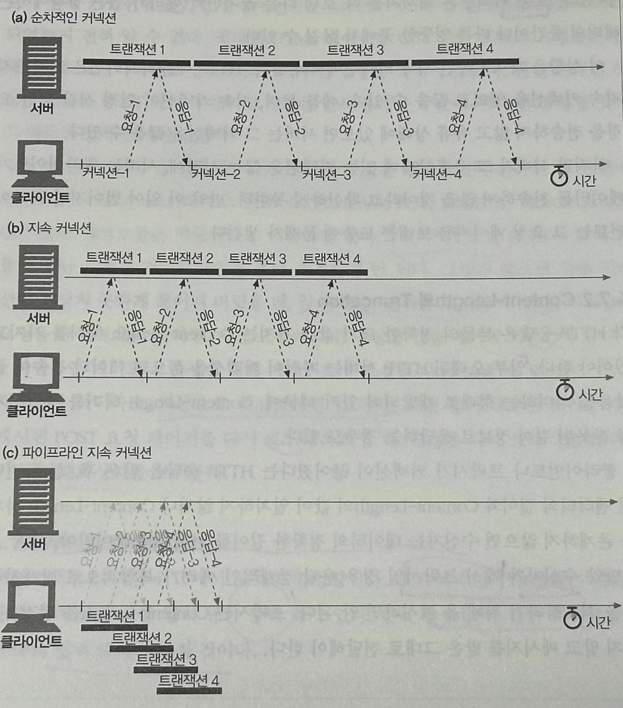

파이프라인에는 여러가지 제약사항이 있다.

- HTTP 클라이언트는 커넥션이 **지속 커넥션인지 확인하기 전**까지는 **파이프라인을 이어서는 안 된다.**
- HTTP 응답은 **요청 순서와 같게 와야 한다.**
    
    → HTTP 메시지는 순번이 매겨져 있지 않아서, 정렬시킬 방법이 없다.
    
- HTTP 클라이언트는 커넥션이 **언제 끊어지더라도,** **완료되지 않은 요청이 파이프라인에 있으면 언제든 다시 요청을 보낼 준비가 되어 있어야 한다.**
- `**POST 요청`과 같이 반복해서 보낼 경우 문제가 생기는 요청(비멱등 요청)은 파이프라인을 통해 보내면 안된다.**
    
    → 에러가 발생하면 파이프라인을 통한 요청 중 어떤 것이 서버에서 처리되었는지 클라이언트는 알 방법이 없고, POST 같은 `비멱등(nonidempotent) 요청`을 재차 보내면 문제가 생길 수 있기 때문.
    

---

## 4.7 커넥션 끊기에 대한 미스터리

커넥션 관리(특히 언제 어떻게 커넥션을 끊는가)에 대한 명확한 기준은 없다. 

### 4.7.1 ‘마음대로’ 커넥션 끊기

어떠한 HTTP 클라이언트, 서버, 혹은 프락시든 **언제든** TCP 전송 커넥션을 끊을 수 있다. 

보통 커넥션은 메시지를 다 보낸 다음 끊지만, `에러`가 있는 상황에서는 엉뚱한 곳에서 끊길 수 있다.

### 4.7.2 Content-Length와 Truncation

각 HTTP 응답은 본문의 정확한 크기 값을 가지는 `Content-Length 헤더`를 가지고 있어야 한다.

클라이언트나 프락시가 커넥션이 끊어졌다는 HTTP 응답을 받은 후, **`실제 전달된 엔티티의 길이`와 `Content-Length`가 일치하지 않거나**, `Content-Length 자체가 존재하지 않으면` 수신자는 데이터의 정확한 길이를 서버에게 물어봐야 한다.

### 4.7.3 커넥션 끊기의 허용, 재시도, 멱등성

- `클라이언트`는 여러 요청을 큐에 쌓아 놓을 수 있지만,
    
    `서버`는 아직 처리되지 않고 스케줄이 조정되어야 하는 요청들을 남겨둔 채로 커넥션을 끊어버릴 수 있다.
    
- 이로 인해, 어떤 요청 데이터가 전송되었지만, 응답이 오기 전에 끊기면 **클라이언트는 실제로 서버에서 얼마만큼 요청이 처리되었는지 전혀 알 수 없다.**

**멱등(idempotent)** : 한 번 혹은 여러 번 실행됐는지에 상관없이 같은 결과를 반환.

- 클라이언트는 멱등이 아닌 요청은 파이프라인을 통해 요청하면 안 된다.
    
    → 전송 커넥션이 예상치 못하게 끊어져 버릴 시, 알 수 없는 결과를 초래
    
- 비멱등인 요청을 다시 보내야 한다면, 이전 요청에 대한 응답을 받기까지 대기.
- 비멱등인 메서드나 순서에 대해서도 자동으로 재시도하면 안 된다.

### 4.7.4 우아한 커넥션 끊기

TCP 커넥션의 양쪽에는 `입력 큐`와 `출력 큐`가 있다. (양방향)

- **전체 끊기와 절반 끊기**
    - 애플리케이션은 TCP 입력 채널과 출력 채널 중 한 개만 끊거나 모두 끊을 수 있다.
        - close() : 전체 끊기
        - shutdown() : 입력 채널이나 출력 채널 중 하나를 개별적으로 끊기 (절반 끊기)

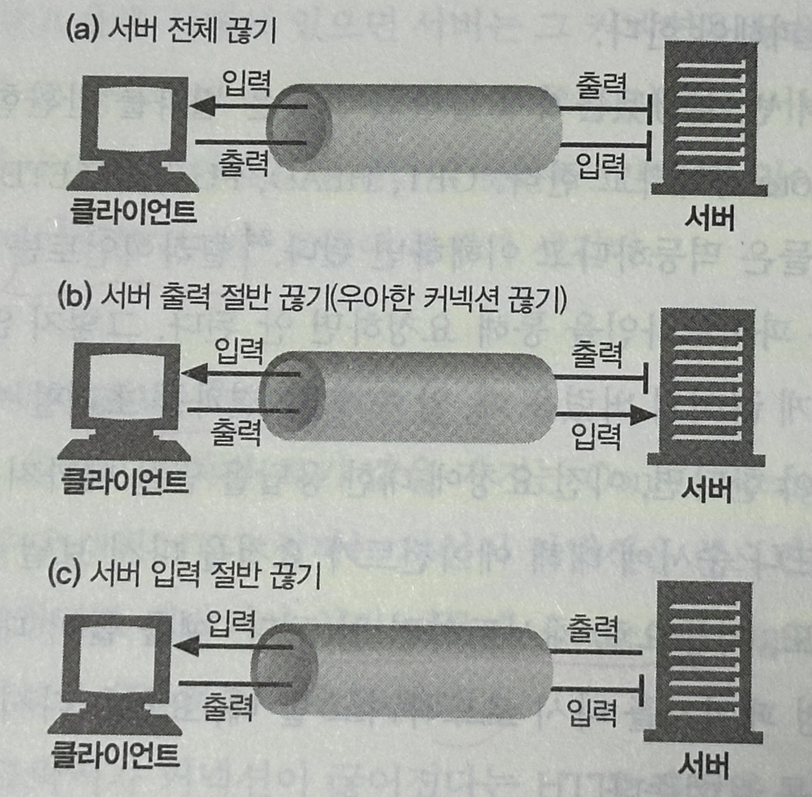

- **TCP 끊기와 리셋 에러**
    - 단순한 HTTP 애플리케이션은 전체 끊기만 사용할 수 있다.
    - 하지만, 애플리케이션이 **각기 다른 `HTTP 클라이언트`, `서버`, `프락시`와 통신할 때**, 그리고 **그들과 파이프라인 지속 커넥션을 사용할 때**, 기기들에 예상치 못한 쓰기 에러가 발생하는 것을 `예방`하기 위해 `절반 끊기`를 사용해야 한다.
    - **보통은 커넥션의 출력 채널을 끊는 것이 안전하다**.
        - 커넥션의 반대편에 있는 기기는 **모든 데이터를 버퍼로부터 읽고 나서 데이터 전송이 끝남과 동시에 서버가 커넥션을 끊었다는 사실을 알게 될 것이다.**
    - 커넥션의 입력 채널을 끊는 것은 위험하다.
        - 클라이언트에서 이미 끊긴 입력 채널에 데이터를 전송하면, 서버의 운영체제는 TCP `connection reset by peer` 메세지를 클라이언트에 보낼 것이다.
        - 대부분 운영체제는 이것을 심각한 에러로 취급하여 버퍼에 저장된, 아직 읽히지 않은 데이터를 모두 삭제한다.
    - 이런 상황은 파이프라인 커넥션에서 더 악화된다.
        - 요청을 파이프라인 지속 커넥션을 통해 전송하였고, 이미 응답이 운영체제 버퍼에 있지만 아직 애플리케이션이 읽지는 않은 경우.
            1. 그 다음 요청을 보냈는데, 서버는 이 커넥션을 충분히 오래 유지했다고 판단하고 연결을 끊어버림
            2. 다음 요청은 이미 종료된 커넥션에 보내졌기 때문에, 서버는 요청을 처리하지 않고 `connection reset by peer` 메시지로 응답한다.
            3. 응답 데이터가 잘 도착하였어도 아직 읽히지 않은 버퍼에 있던 응답 데이터가 모두 사라짐

- **우아하게 커넥션 끊기**
    - 애플리케이션 `**자신의 출력 채널`을 먼저 끊고**, `**다른 쪽에 있는 기기의 출력 채널`이 끊기는 것을 기다리는 것**이다.
    - 양쪽에서 더는 데이터를 전송하지 않을 것이라고 알려주면, **커넥션은 리셋의 위험 없이 온전히 종료**된다.
    - 하지만, 상대방이 **절반 끊기를 구현했다는 보장도 없고**, **절반 끊기를 검사해준다는 보장도 없다.**
    - 따라서, `커넥션을 우아하게 끊고자 하는 애플리케이션`은 출력 채널에 절반 끊기를 하고 난 후에도 **입력 채널에 대해 상태 검사를 주기적으로 해야 한다.**
    - 만약 입력 채널이 특정 타임아웃 시간 내에 끊어지지 않으면, 애플리케이션은 리소스를 보호하기 위해 커넥션을 강제로 끊을 수도 있다.