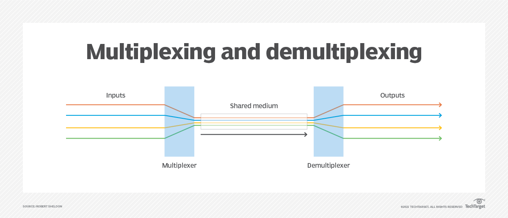

# 05. 웹 서버

 

# 커넥션 다중화 (Multiplexing)

다중접속 서버의 구현을 위해 클라이언트의 연결요청이 있을 때마다 새로운 프로세스를 생성한다.

`프로세스의 생성`에는 **상당히 많은 대가를 지불**해야 하고, **많은 양의 연산**이 요구되며, **필요한 메모리 공간도 비교적 큰 편**이다. 

또한, 프로세스마다 별도의 메모리 공간을 유지하기 때문에, 상호 간에 데이터를 주고받으려면 다소 복잡한 방법을 택할 수밖에 없다.

프로세스의 생성을 동반하지 않으면서 다수의 클라이언트에게 서비스를 제공할 수 있는 방법으로 `다중 I/O 서버`가 있다.

하지만 이 모델은 구현하고자 하는 서버의 특성에 따라서 구현방법이 달리 결정되어야 한다. 즉 이 방법이 모든 경우에 있어서 최선은 아니다.

## 다중화

- `하나의 통신 채널`을 통해서 `둘 이상의 데이터(시그널)`를 전송하는 방식.
- **다수의 프로세스를 생성하지 않고도** 여러 클라이언트에게 서비스를 제공할 수 있는 기술.
- 다수의 신호들을 단일 데이터 링크로 동시에 전송하게 하는 기술.
- **Multiplexer**
    - 다수의 스트림을 하나의 스트림으로 결합하는 기기.
    - 여러 입력 중 하나를 선택해 출력으로 내보내는 논리 회로.
- **Demultiplexer**
    - 하나의 스트림을 다수의 스트림으로 분리하는 기기.
    - 하나의 입력을 여러 개의 출력 중 하나를 선택하여 내보내는 논리 회로.
- 전송계층에서의 다중화란, 응용 계층의 여러 소켓에서 전송되는 데이터를 하나로 모으는 것.
    - 전송 계층의 Segment, 네트워크 계층의 Packet
- Demultiplexing (역다중화) : 전송 받은 Segment를 적절한 소켓에 분배해 주는 것.

## I/O 멀티플렉싱 서버

- 하나의 프로세스를 통해 여러 개의 클라이언트들과 통신하는 방식의 서버를 말한다.
- 각 소켓의 `파일디스크립터`를 **리스트화하여 저장** 시켜두고, **각 소켓의 입/출력 스트림을 감시**하다가 클라이언트로부터 **데이터가 수신**되어 입력스트림에 저장되면 이에 대한 것을 해당 소켓에게 **클라이언트의 요청이 왔다고 알려주고** 서버와 통신을 하게 된다.
    - 파일디스크립터 : 리눅스 혹은 유닉스 계열의 시스템에서 프로세스(process)가 파일(file)을 다룰 때 사용하는 개념으로, 프로세스에서 특정 파일에 접근할 때 사용하는 추상적인 값 (일반적으로 0이 아닌 정수값을 갖음)
- 멀티플렉싱을 이용하면, **서버에서 생성하는 프로세스의 수가 줄어든다.**
    - **멀티프로세스 서버 모델**
        
        
        
    - **멀티플렉싱 서버 모델**
        
        
        

## select() 함수

- 소켓을 감시하는 역할을 수행하는 것은 **유닉스 계열**에서 **`select()`** 라는 함수가 수행
    
    
    
    - 파일 디스크립터를 리스트화 하여 등록시켜두면, 각 파일 디스크립터의 상태를 감시한다.
    - 이벤트(입/출력, 예외)별로 감시할 파일들을 `fd_set` 이라는 `File State Table (=File Descriptor 배열)`에 등록하고 , 이 중에서 이벤트 발생 시 `fd_set`을 확인하는 방식으로 작동한다.
        - 0 → 변화 X
        - 1 → 변화 O. 해당 FD 파일은 읽을 데이터가 있다는 표시.
    - FD 배열 중 입/출력이 준비된 파일이 발생하면(3, 5번 파일), FD의 수를 반환하고 해당 파일에 대해 입출력 수행.
        - 즉, **한 곳에 여러 FD를 모아놓고 상태를 계속 관찰하는 함수**
        - 입출력이 완료된 파일들은 감시대상에서 제거 (1 → 0)

## I/O 멀티플렉싱 (Asynchronous Blocking I/O)
- I/O 입장에서는 다중화는 `한 프로세스가 여러 파일(file)을 관리`하는 기법
- 각 파일을 처리할 때마다 개별 I/O 통로를 만들어 프로세스(스레드)를 만들면 **IPC, 동기화, 스레드, Context Switching 등의 Overhead 단점**이 발생.
- 하나의 채널을 통해 여러 데이터를 송/수신 하여 **프로세스 개수를 최소한으로 유지**.
- 필요한경우
    - TCP Client가 **다수의 Descriptor**를 처리해야 하는 경우
    - TCP Client가 **다수의 Socket**을 동시에 처리해야 하는 경우
    - TCP Server가 **Listening Socket과 Connected Socket을 모두 처리**해야 하는 경우
    - Server가 **TCP와 UDP를 동시에 지원**해야 하는 경우
    - Server가 **여러 서비스 혹은 프로토콜을 처리**해야 하는 경우
- select 같은 기법으로 **여러 I/O 작업을 독립적으로 관리**할 수 있다
    
    
    
    - select() 함수를 호출해서 여러 소켓 중 `data ready` 상태가 된 소켓이 있을 때까지 대기.
    - select() 결과로 read() 함수를 호출할 수 있는 소켓의 목록이 반환되면 해당 소켓에 대해 read() 함수 호출.
    - 여러 소켓을 동시에 확인하여 하나 이상의 소켓이 준비될 때 까지 대기.
    - kernel의 응답을 기다리다 보면 kernel에서 결과 값이 준비되었다는 callback 신호가 오고 user process는 자신의 buffer로 데이터를 복사해온다.
      - select 방식의 실제 구현으로 들어가면 select 호출 결과가 유의미한 값으로 나올 때까지 user process에서 loop를 돌리며 대기하는 방식
    - (개념적으로) 여러 스레드가 Blocking I/O를 실행하는 것으로 구현되어 있음
    - read, write 같은 I/O 작업 자체가 block 되는 것이 아니라 select, poll 같은 **mutliplexing 관련 system call에 대한 kernel의 응답이 block**

- 장점
    - 단일 프로세스(스레드)에서 여러 파일의 입출력 처리가 가능하여 **동시에 수만 개의 커넥션도 처리 가능**.
    - POSIX 표준을 따르기 때문에 `이식성`이 좋음
    - 클라이언트 요청마다 처리하기 위한 별도의 쓰레드를 만들지 않아 Context Switching 하는 **Overhead 가 발생하지 않는다.**
- 단점
    - select 함수를 호출해서 전달된 정보는 커널에 등록되지 않은 것이라서 **호출할 때 마다 매번 관련 정보를 전달**해야 함.
    - select 함수의 리턴값이 이벤트가 발생한 `FD의 개수` 이기 때문에 **어떤 FD에서 이벤트가 발생했는지 확인하려면 fd_set 테이블 전체를 검사**해야 함.
    - **검사할 수 있는 FD 개수에 제한**이 있음 (최대 1024개)
    - **select 함수를 호출할 때 마다 데이터를 복사**해야 함
        - select 함수를 호출한 후 이벤트를 처리할 때 fd_set 테이블 변경이 필요하기 때문에 미리 복사가 필요함

- [더 자세히 알아보기](https://blog.naver.com/n_cloudplatform/222189669084)

 

## 단어 관련

### reverse DNS

해외 메일서버들이 **SpamMail 여부를 확인할 때 IP에 해당하는 도메인**이 있는지 검사한다.

이때 조회되는 것이 `Reverse DNS`이고, **DNS의 영방향 조회**를 뜻한다.

즉, 일반적인 DNS 역할이라고 할 수 있는 도메인에  대한 질의가 아닌 반대로 **IP 에 대한 질의를 의미**.

- 정방향 (도메인에 대한 질의) : 도메인 IP
- 역방향 (IP 에 대한 질의) : IP -> 도메인

### hostname lookup

`역방향 DNS 조회`라고도 알려진 `호스트 이름 조회`는 **특정 IP 주소와 연결된 호스트 이름을 확인하는 프로세스**.

일반적인 `정방향 DNS 조회`에서는 **호스트 이름을 제공**하고 **해당 IP 주소를 가져오며**,

`역방향 DNS 조회`에서는 **IP 주소를 제공**하고 **연결된 호스트 이름을 받는다**.

호스트 이름 조회는 일반적으로 네트워크 문제 해결, 보안 분석, 로깅 등 다양한 목적으로 사용된다.

이는 특히 IP 주소만 기록되는 경우, 

네트워크 트래픽의 출처를 식별하는 데 도움이 될 수 있으며, IP 주소의 역방향 DNS 레코드를 확인하여 요청된 호스트 이름과 일치하는지 확인하여 이메일 보낸 사람의 적법성을 확인하는 데 사용할 수 있다.

### hostname resolution

`Hostname Resolution`은 **주어진 이름에 대한 IP주소를 알아내는 과정**을 말한다.

사람의 입장에서는 이름을 사용하는 것을 선호하기 때문에, **도메인과 IP주소간에 변환할 수 있는 방법과 방식이 필요**하다. 도메인 이름을 입력시 TCP/IP는 이 의미를 갖는 단어들을 IP주소로 번역해야한다.

일반적으로는 `DNS(Domain Name Server)`가 **이 역할을 담당한다.**

- DNS를 사용할 수 없는 경우에는 OS 자체적으로 DNS에 담겨 있듯이 맵핑 정보를 등록하여, 올바른 TCP/IP를 찾아갈 수 있어야한다. 이에 대한 우선순위를 설정하는 것은 매우 중요한 부분이다.

- **IETF ident 프로토콜**
    
    `ident 프로토콜`은 서버에게 **어떤 사용자 이름이 HTTP 커넥션을 초기화**했는지 찾아낼 수 있게 해준다.
    
    이 정보는 특히 웹 서버 로깅에서 유용하기 때문에, 널리 쓰이는 **일반 로그 포맷**(Common Log Format)의 `두 번째 필드`는 각 HTTP 요청의 ident 사용자 이름을 담고 있다.
    
    ident는 조직 내부에서는 잘 사용할 수 있지만, 공공 인터넷에서는 트랜잭션 시간과 보안 등을 이유로 잘 동작하지 않는다.
    

### 서버사이드 인클루드(Server-Side Includes, SSI)

`서버사이드 인클루드(Server-Side Includes, SSI)`는 서버 측에서 웹 페이지를 생성할 때 사용되는 기술이다.

이 기술은 HTML 문서나 웹 페이지의 다른 형식에 **서버 측에서 동적으로 콘텐츠를 포함**할 수 있게 해주어서,

주로 반복되는 내용이나 동적으로 변경되는 정보를 웹 페이지에 삽입할 때 사용된다.

SSI를 사용하면 웹 페이지의 **유지 보수가 쉬워지고**, **코드의 재사용성**이 높아진다.

이는 웹 서버에서 지원되어야 하며, 서버 설정에서 SSI를 활성화 해야한다.