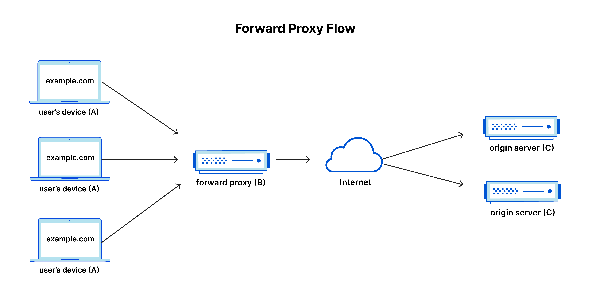

# 06. 프락시

# 리버스 프록시

`리버스 프록시`는 **웹 서비스의 성능 향상**, **보안 강화** 및 **유연한 확장성 제공** 등 다양한 이점을 제공한다.

클라이언트와 웹 서버 간의 `중개자 역할`을 하는 서버로, **클라이언트로의 요청을 대신 받아 웹 서버에 전달**하고, **웹 서버의 응답을 클라이언트에게 전달**하는 역할을 수행한다.

이를 통해 리버스 프록시는 **웹 서버의 부하를 분산**시키고, **보안을 강화**하는 등 다양한 기능을 수행할 수 있다.

### **기본 작동 원리**

클라이언트가 리버스 프록시에 요청을 보내면, 리버스 프록시는 요청을 웹 서버에 전달하고, 웹 서버는 요청된 데이터를 처리한 후 리버스 프록시에게 응답을 보낸다. 그리고 리버스 프록시는 웹 서버로부터 받은 응답을 클라이언트에게 전달하는 방식으로 동작합니다

### **장점**

- **서버 부하 분산 (Load balancing)**
    
    웹 서비스에 동시에 많은 사용자가 접속할 경우, 서버에 부하가 집중되어 **성능 저하 및 서비스 중단**이 발생할 수 있다. 리버스 프록시는 들어오는 요청을 **여러 대의 서버로 분산**시켜 각 서버의 부하를 줄이고, **서버의 가용성을 높여** 안정적인 서비스 제공이 가능하도록 한다.
    
- **보안 강화**
    
    리버스 프록시는 외부에서 직접 서버에 접근하지 못하도록 하여, 웹 서비스의 보안을 강화한다. 클라이언트 요청은 먼저 리버스 프록시를 거쳐 서버로 전달되며, 이 과정에서 리버스 프록시는 `악성 요청 필터링`, `접근 제한`, `SSL 암호화 처리 집중` 등의 역할을 수행하여 서버를 보호.
    
- **캐싱 및 가속화**
    
    리버스 프록시는 **자주 사용되는 정적 파일들(Image, CSS, JavaScript 등)을 캐시에 저장**하여 빠르게 제공할 수 있다. 이로 인해 서버의 부하를 줄이고 응답 시간을 단축시켜 웹 서비스의 성능을 향상시킬 수 있다.
    

### **단점**

- **추가적인 서버 설정과 관리**
    - 리버스 프록시를 사용하려면 **추가적인 서버 설정과 관리가 필요**.
- **네트워크 지연**
    - 리버스 프록시를 통과하는 모든 요청에 대해 **약간의 네트워크 지연**이 발생할 수 있다.
- **복잡성 증가**
    - 리버스 프록시가 있는 아키텍처는 **일부 경우에 복잡성이 증가**할 수 있다.

 

## 인터셉트 프록시

클라이언트와 서버 사이에 위치하여, 클라이언트에서 요청하는 트래픽을 중간에서 가로채고 변경하거나 검사하는 등 **통신을 제어하고 감시**할 수 있다.

### 주요 목적

- 일반적으로 네트워크 보안, 트래픽 모니터링, 애플리케이션 보안 등 다양한 용도로 사용
- `보안 검사`, `트래픽 로깅`, `규정 준수 검사`, `콘텐츠 필터링`, `로드 밸런싱`, `캐시` 등 **다양한 기능을 구현**할 수 있다.
    - **악성 코드나 악의적인 행위를 감지하고 차단**하거나, **콘텐츠 필터링**을 통해 웹사이트 접근 제어를 수행할 수 있다.
    - 애플리케이션의 보안 취약점을 탐지하고 예방하기 위해 트래픽을 분석하고 수정할 수 있다.
    - 캐시를 통해 자원 접근 속도를 개선할 수 있다.
        - 이미 요청된 데이터는 프록시 서버에 저장되어, 다음에 해당 데이터가 요청될 때 프록시 서버에서 바로 제공

 

## VPN vs 프록시

`VPN(Virtual Private Network)`과 `프록시(Proxy)`는 인터넷 사용자의 **개인 정보 보호와 온라인 안전성**을 강화하는 데 사용되지만, 작동 방식과 목적에 있어서 차이가 존재.

`VPN`은 모든 인터넷 트래픽을 암호화하여 보호하고 사용자의 IP 주소를 숨기는 반면, `프록시`는 주로 웹 브라우징을 익명화하거나 접근 제한된 콘텐츠에 접속하기 위해 사용된다.

`VPN`은 보다 포괄적이고 보안 중심적이며, `프록시`는 주로 익명성과 접근 제어에 중점을 둔다.

|  | VPN | 프록시 |
| --- | --- | --- |
| 목적 | 주로 개인 정보 보호와 온라인 안전성을 강화하기 위해 사용. VPN은 사용자의 인터넷 연결을 암호화하여 외부의 감청이나 감시를 방지하고, 사용자의 IP 주소를 숨기거나 변경하여 온라인 익명성을 제공합니다. | 주로 웹 브라우징을 익명화하거나 접근 제한된 콘텐츠에 접속하기 위해 사용. 프록시는 사용자의 요청을 중간에서 전달하여 요청을 생성한 사용자의 IP 주소를 숨길 수 있다. |
| 암호화 | 모든 인터넷 트래픽을 암호화하여 보호한다. 외부의 감청이나 감시를 방지하고 데이터 유출을 막는다. | 보통은 데이터를 암호화하지 않는다. 프록시는 단순히 요청을 중개하고 응답을 전달하는 역할을 한다. |
| 적용 범위 | 사용자의 모든 인터넷 트래픽을 보호하므로, 모든 애플리케이션 및 인터넷 서비스에 적용. | 보통은 웹 브라우저나 특정 애플리케이션에만 적용 일부 프록시는 시스템 전체의 트래픽을 중계할 수 있지만, 일반적이지는 않다. |
| 속도 | 암호화와 데이터 전송을 위한 추가 오버헤드로 인해 속도가 다소 느릴 수 있다. | VPN보다 일반적으로 더 빠르며, 암호화 없이 중간에서 요청을 중계하기 때문에 더 빠를 수 있다. |
| 연결성 | 프록시에 비해 상대적으로 안정적 | 연결 중단이 자주 발생 |

---