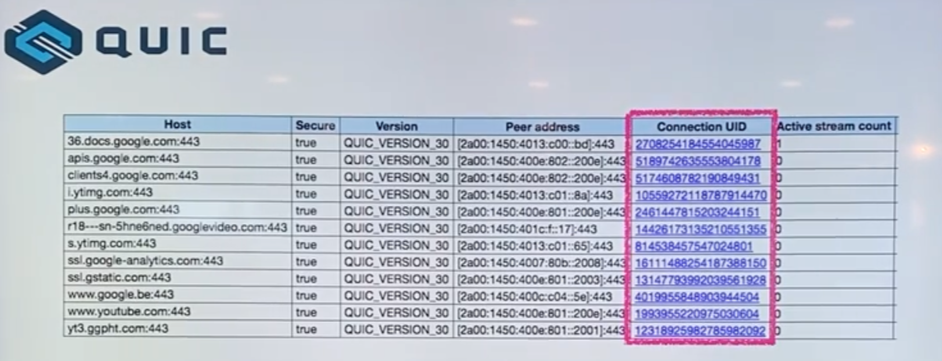

# 10. HTTP/2.0

# HTTP/2.0

- HTTP 메시지 전송 방식의 변화
- 요청과 응답의 다중화
- 리소스간 우선 순위 설정
- Server Push
- Header 압축
- TCP 기반
- TCP의 HOL(Head Of Line) Blocking

## HTTP/2.0의 기본 목표

- `멀티플렉싱`을 통해 **Latency 줄이기**
- `헤더압축`을 통해 **Overhead 최소화하기**
- `서버푸시` **기능을 지원하기**

## **Frame, Message, Stream**

### **Frame**

- HTTP/2.0에서 통신의 **최소 단위**
- HTTP/1.1 (문자열) -> HTTP/2.0 (**binary**) 로 메시지 전송 방식이 변경.
    - 바이너리 프레이밍 계층 추가.
    - 메시지를 프레임 단위로 분할하여 바이너리로 인코딩
    - 파싱, 전송 속도가 상승하고 텍스트보다 오류 발생 가능성이 낮아짐.
- 최소 하나의 프레임 헤더를 갖는다.

### Message

- 다수의 프레임으로 연결되어있다.
- **요청, 응답의 단위**

### Stream

- 양방향 통신을 통해 전달되는 한 개 이상의 메시지
- 프레임이 모여 메세지, 메세지가 모여 스트림이 된다.
- 프레임으로 쪼개졌기에 메시지 안의 순서가 사라진다.
    - 인터리빙이 가능해져서, 먼저 도착한 것이 조립됨.
    - 인터리빙(interleaving)
        - 멀티플렉싱(multiplexing)의 일환으로, 여러 개의 HTTP 요청과 응답을 하나의 TCP 연결에서 동시에 전송하는 것을 의미. 이를 통해 HTTP/1.1에서의 HOL(Head-of-Line) Blocking 문제를 해결하고, 네트워크 효율성을 크게 개선

## 멀티플렉싱

- 멀티플렉싱(다중화) : 하나의 전송로에서 여러 데이터를 요청, 응답하는 것
- **요청과 응답의 병렬처리가 가능하다.**
    - HOL blocking 문제 해결
- 대신 TCP Layer상에서는 HOL blocking 여전히 존재한다.
    - 예를 들어 하나의 stream 요청이 느리면 그 뒤에도 막혀버린다.
- 하나의 Connection에서 데이터 요청과 응답이 가능하다.
  
- 대부분의 HTTP 전송은 수명이 짧고 폭주하는 반면, TCP는 수명이 긴 대량 데이터 전송에 최적화되어 있다.

## 헤더 압축

`HTTP 1.x` → 중복되는 Header 존재

`HTTP 2.0` → 중복되는 Header 문제 해결

### HPACK 압축 방식

- 헤더 인덱싱
    
    
    
    - 중복되는 헤더 : 헤더 테이블에 있는 index 값만 내려주어 성능을 개선.
    - 인코딩 중복되지 않는 헤더는 허프만 인코딩을 한다.
        - [https://http2.tistory.com/2](https://http2.tistory.com/2)

### **서버 푸시**

- **HTTP/1.x 의 웹페이지 요청**
    1. HTML 요청
    2. HTML 태그 파싱
    3. 필요한 리소스 재요청 (css, js, png, video 등)
    4. 웹페이지 완성
- **HTTP/2.0 의 웹페이지 요청**
    1. HTML 요청
    2. 웹페이지 완성
    - HTML을 요청하면, 관련된 리소스를 서버에서 능동적으로 보내줄 수 있기 때문에.
        
        
        

### **주요 사용사례**

1. **대형 웹사이트 및 플랫폼**
    - **Google**: Google의 대부분의 서비스는 HTTP/2.0을 사용한다.
        - `Gmail`, `Google Search`, `Google Maps` 등이 이에 해당.
    - **Facebook:** Facebook은 HTTP/2.0을 사용하여 사용자 경험을 향상시키고, 페이지 로딩 시간을 단축한다.
    - **X(Twitter)**: Twitter는 HTTP/2.0을 통해 빠른 데이터 전송과 효율적인 연결 관리를 구현한다.
2. **콘텐츠 전송 네트워크 (CDN)**
    - **Akamai**: Akamai의 CDN 서비스는 HTTP/2.0을 지원하여 콘텐츠 전송 속도를 개선한다.
    - **Cloudflare**: Cloudflare는 HTTP/2.0을 기본으로 지원하여 웹사이트의 성능을 향상시킨다.
    - **Fastly**: Fastly의 CDN은 HTTP/2.0을 사용하여 빠르고 안정적인 콘텐츠 제공을 보장한다.
3. **전자 상거래 플랫폼**
    - **Amazon**: Amazon은 HTTP/2.0을 사용하여 대규모 트래픽을 효율적으로 관리하고, 쇼핑 경험을 향상시킨다.
    - **eBay**: eBay는 HTTP/2.0을 통해 빠르고 안정적인 사용자 경험을 제공한다.
4. **미디어 스트리밍 서비스**
    - **Netflix**: Netflix는 HTTP/2.0을 사용하여 고속 스트리밍과 효율적인 데이터 전송을 구현한다.
    - **YouTube**: YouTube는 HTTP/2.0을 통해 동영상 로딩 시간을 줄이고, 고품질 스트리밍 서비스를 제공한다.

## HTTP/2.0 의 한계

HTTP/2.0은 HTTP의 **HOL(Head of Line) Blocking를 해결**하였으나,

**TCP의 HOL Blocking 문제가 여전히 남아있다.**

- TCP 3-hand-shaking 하고 TLS 3-hands-shaking 이 동시에 일어나게 되어서 통신의 연결 상에서 TCP의 성능에 문제가 발생
- 스트림이 병렬로 처리되는 와중에 A 스트림의 데이터가 손실이 되어 사라지면, 다른 스트림들이 다 대기 상태가 된다. 서버에서 해당 데이터를 찾아올 때까지 관련없는 스트림들도 대기

 

# HTTP/3.0

- HTTP 3.0 = **QUIC + HTTP 2.0**
- **QUIC 프로토콜 기반**: `UDP를 기반`으로 하여 연결 설정 시간을 단축하고 패킷 손실에 대한 회복력을 향상시킨다.
- **빠른 연결 설정**: `0-RTT(Zero Round Trip Time) 핸드셰이크`를 통해 연결 설정 시간이 대폭 감소한다.
- **개선된 보안**: `TLS 1.3`을 사용하여 기본적으로 암호화된 연결을 제공한다.
- **멀티플렉싱 개선**: 단일 연결 내에서 여러 스트림을 `독립적으로 전송`하여 HTTP/2.0의 HOL(Head-of-Line) Blocking 문제를 해결한다.
- **패킷 손실에 강한 회복력**: QUIC의 `스트림별 전송 방식`은 패킷 손실 발생 시 전체 연결을 재설정하지 않고도 복구가 가능한다.

## **QUIC (Quick UDP Internet Connections)**

- TCP의 한계(지연 불가피)를 극복하려는 `전송 프로토콜`
- 전송 속도 향상
- Connection UUID로 서버와 연결
- TLS 기본 적용
- 독립 스트림 사용
- 현재 구글 관련 제품 대부분의 기본 프로토콜
- UDP 기반으로 만들었음

## UDP

HTTP/1.x, HTTP/2.0에서 사용한 TCP와 달리 비연결형 프로토콜 UDP를 사용한다.

- 전송 속도 향상
    - 미리 connection을 맺지 않고, **첫 연결 설정에서 필요한 정보와 함께 데이터를 전송**한다.
    - 연결 성공 시, **설정을 캐싱하여 다음 연결 때 바로 성립이 가능**하다.
    
- TCP 연결 및 전송
    
    
    

- QUIC 연결 및 전송
    
    
    

- QUIC 전송 (Connection ID)
    
    
    

- Connection UUID 라는 고유한 식별자로 서버와 연결한다.
    
    
    
    - 커넥션 재수립이 필요 없다.
        - 한번 연결되면, WiFi가 변경되거나 하더라도 커넥션 재수립 X
- TLS가 기본적으로 적용되어서 **보안성 향상**되며, **IP Spoofing / Replay Attack을 방지**한다.
- UDP의 특성인 신뢰성이 없다는 한계를 **QUIC에서 보완**하고 있다.
    
    
    
    - 신뢰성 레이어 추가
        - 패킷 재전송
        - 혼잡 제어
        - 손실 회복
        - 기타 TCP 기능 지원

## 독립 스트림

- HTTP/2.0에서 TCP layer에서의 HOL Blocking 해결
    - 독립된 스트림을 갖고 있기 때문에, 각 스트림은 서로에게 영향을 끼치지 않는다.

## 사용 사례

1. **대형 웹사이트 및 플랫폼**:
    - **Google**: Google의 검색, Gmail, Google Drive 등 다양한 서비스에서 HTTP/3를 사용하여 빠르고 안전한 데이터 전송을 구현하고 있다.
    - **YouTube**: 동영상 스트리밍에서 HTTP/3를 사용하여 버퍼링을 줄이고 빠른 로딩 시간을 제공한다.
        
        
        
    
    - **Facebook**: Facebook은 HTTP/3를 통해 사용자 경험을 개선하고, 빠른 페이지 로딩을 지원한다.
2. **콘텐츠 전송 네트워크 (CDN)**:
    - **Cloudflare**: Cloudflare는 HTTP/3를 지원하여 빠르고 안정적인 콘텐츠 전송을 제공한다. 많은 웹사이트가 Cloudflare를 통해 HTTP/3의 혜택을 누리고 있다.
    - **Akamai**: Akamai는 HTTP/3를 지원하여 전 세계 사용자에게 빠른 콘텐츠 전달을 가능하게 한다.
    - **Fastly**: Fastly의 CDN 서비스는 HTTP/3를 통해 성능을 극대화하고 있다.
3. **브라우저 지원**:
    - **Google Chrome**: Chrome 브라우저는 HTTP/3를 기본적으로 지원하여 사용자에게 빠른 웹 탐색 경험을 제공한다.
    - **Mozilla Firefox**: Firefox 역시 HTTP/3를 지원하여 최신 웹 표준을 따르고 있다.
    - **Microsoft Edge**: Edge 브라우저도 HTTP/3를 지원하여 빠르고 안전한 웹 경험을 제공한다.
4. **스트리밍 서비스**:
    - **Netflix**: Netflix는 HTTP/3를 사용하여 빠른 스트리밍 시작과 중단 없는 동영상 재생을 구현하고 있다.
    - **Spotify**: Spotify는 HTTP/3를 통해 빠른 음악 스트리밍과 안정적인 연결을 제공한다.
5. **클라우드 서비스**:
    - **Amazon Web Services (AWS)**: AWS는 HTTP/3를 지원하는 여러 서비스를 제공하여 클라우드 애플리케이션의 성능을 향상시키고 있다.
    - **Microsoft Azure**: Azure는 HTTP/3를 통해 클라우드 기반 애플리케이션의 빠른 연결과 데이터를 전송을 지원한다.
    - **Google Cloud Platform (GCP)**: GCP는 HTTP/3를 사용하여 클라우드 서비스의 성능을 최적화한다.

 

## **HTTP/2.0과 HTTP/3.0의 공존**

HTTP/2.0과 HTTP/3.0 둘 다 사용하는 이유는 이들 `프로토콜의 발전`과 그에 따른 `성능 개선`을 통해 **사용자 경험을 향상시키기 위해서**다.

예를들어, 구글의 다양한 서비스는 HTTP/2.0을 통해 이미 성능을 개선했으며, HTTP/3.0을 통해 더 빠르고 안전한 웹 통신을 구현하고 있다.

HTTP/2.0과 HTTP/3.0은 서로 다른 장점을 가지고 있으며, 구글은 이를 단계적으로 도입하고 있다.

1. **HTTP/2 사용 사례**:
    - **성능 개선**: HTTP/2.0은 `멀티플렉싱`, `헤더 압축`, `서버 푸시` 등의 기능을 통해 HTTP/1.1에 비해 **성능을 크게 향상**시킨다. 구글은 이러한 HTTP/2.0의 장점을 활용하여 다양한 서비스의 속도와 효율성을 높였다.
    - **기존 지원**: 많은 웹 브라우저와 서버가 HTTP/2.0을 지원하기 때문에, 구글은 이를 통해 안정적인 성능을 제공한다.
2. **HTTP/3 사용 사례**:
    - **최신 기술 도입**: HTTP/3.0은 HTTP/2.0의 한계를 극복하고 더 나은 성능을 제공하기 위해 `QUIC 프로토콜을 기반`으로 한다. 이는 특히 네트워크 지연 시간이 중요한 애플리케이션에서 큰 장점을 제공한다.
    - **빠른 연결 설정과 보안 강화**: HTTP/3는 `0-RTT 핸드셰이크`와 `TLS 1.3`을 통해 **연결 설정 시간을 단축하고 보안을 강화**한다.
    - **점진적 전환**: 구글은 HTTP/3.0을 점진적으로 도입하여 새로운 기술의 혜택을 누리면서도, 아직 HTTP/3.0을 지원하지 않는 클라이언트와 서버를 위해 HTTP/2.0도 계속 지원한다.

 

# TCP / UDP

### UDP Header

- 데이터 전송에 집중한 설계
- 별도의 기능 X
    - 원하는 기능 구현 O
    - TCP의 지연을 줄이면서 TCP만큼 신뢰성 확보 가능

### TCP Header

- 신뢰성을 확보하지만 지연을 줄이기 힘든 구조

### TCP vs UDP 비교
|  | TCP | UDP |
| --- | --- | --- |
| 연결 방식 | 연결형 서비스 | 비연결형 서비스 |
| 패킷 교환 | 가상 회선 방식 | 데이터그램 방식 |
| 전송 순서 보장 | 보장함 | 보장하지 않음 |
| 신뢰성 | 높음 | 낮음 |
| 전송 속도 | 느림 | 빠름 |